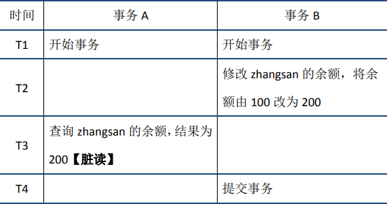
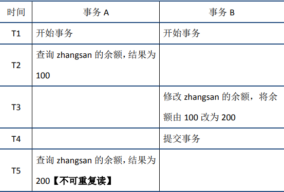
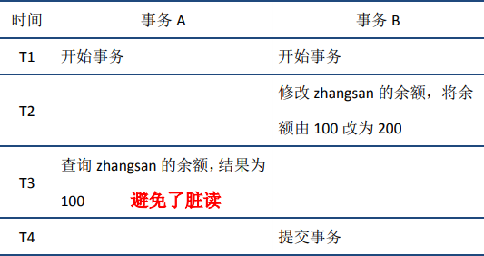
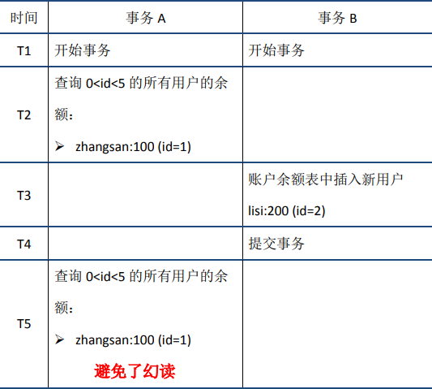

# MySQL

## 第零章 MySQL架构

### 0.1 MySQL的客户端／服务器架构

#### 0.1.1 什么是Mysql的服务端，客户端？

- mysqld是**服务端**程序
- mysql是命令行**客户端**程序

#### 0.1.2 如何启动Mysql的服务端和客户端？

- 启动服务器端

  ```bash
  net	start MySQL
  ```

- 启动客户端

  ```bash
  mysql -hlocalhost -uroot -p123456
  mysql -h localhost -u root -p 123456(错误写法)
  ```

#### 0.1.3 Mysql支持的客户端进程和服务器进程的通信方式

##### 1. TCP/IP

MySQL服务器会默认监听3306端口。

##### 2. 命名管道和共享内存

- 使用**命名管道**来进行进程间通信 

  需要在启动服务器程序的命令中加上--enable-named-pipe参数，然后在启动客户端程序的命令中加⼊--pipe或者--protocol=pipe参数。 

- 使用**共享内存**来进行进程间通信 

  需要在启动服务器程序的命令中加上--shared-memory参数，在成功启动服务器后，共享内存便成为本地客户端程序的默认连接⽅式，不过我们也可以在启动 客户端程序的命令中加⼊--protocol=memory参数来显式的指定使用共享内存进行通信。

##### 3. Unix域套接字文件 


### 0.2 一条 SQL 语句在 MySQL 中如何执行的？


1. 客户端请求
2. 连接器（验证用户身份，给予权限）
3.  查询缓存（存在缓存则直接返回，不存在则执行后续操作）
4.  分析器（对 SQL 进行词法分析和语义分析操作）
5. 优化器（主要对执行的 sql 优化选择最优的执行方案方法）
6.  执行器（执行时会先看用户是否有执行权限，有才去使用这个引擎提供的接口）
7. 去引擎层获取数据返回（如果开启查询缓存则会缓存查询结果）


### 0.3 MySQL Query Optimizer的作用


## 第一章 存储引擎和字符集

### 1.1 存储引擎定义

现代数据库大体可以分为三层。最上层用于连接、线程处理等；中间层提供数据库的核心功能，包括 SQL 解析、分析、优化、视图等；底层就是数据库的存储引擎，**负责数据的存储与提取**。

简单来说，存储引擎是为数据库**提供创建、查询、更新、存储数据的软件模块**。不同的存储引擎的主要区别是数据的**存储方式**，此外功能、特性、速度等也有所差异。

存储引擎为数据库屏蔽了底层存储的细节。现在许多数据库管理系统都支持多种存储引擎，通过插件化的方式配置。可以根据具体场景，选择不同的存储引擎。


### 1.2 MySQL 支持的存储引擎

在 MySQL 中执行 `SHOW ENGINES;`，可以看到支持的存储引擎列表，不同环境下可能有一定差异： 

MySQL 的存储引擎主要分为两大类：**事务型、非事务型**，从上图中的“Transactions”一列可以看出来，只有 InnoDB 引擎支持事务。

在 MySQL 5.5 及之后的版本中，默认的存储引擎是 InnoDB，而在这之前是 MyISAM。


| 特性                          | InnoDB        | MyISAM   | Memory |
| ----------------------------- | ------------- | -------- | ------ |
| 事务(Transactions)            | ✔️             | ✖️        | ✖️      |
| 外键支持(Foreign key support) | ✔️             | ✖️        | ✖️      |
| 锁机制(Locking granularity)   | 行级锁        | 表级锁   | 表级锁 |
| 多版本并发控制(MVCC)          | ✔️             | ✖️        | ✖️      |
| B树索引(B-tree indexes)       | ✔️             | ✔️        | ✔️      |
| 哈希索引(Hash indexes)        | ✖️(自适应哈希) | ✖️        | ✔️      |
| 全文索引(Full-text indexes)   | ✔️             | ✔️        | ✖️      |
| 空间使用                      | 高            | 低       | N/A    |
| 查询速度                      | 低（？）      | 高（？） | 高     |
| 插入速度                      | 低            | 高       | 高     |

Innodb buffer pool够大, innodb的数据会全缓存进内存；而myisam只有索引在内存里, 其他字段的缓存还得依赖OS本身的cache


### 1.3 Mysql的字符集

#### 1.3.1 定义

将一个字符映射成一个二进制数据的过程也叫做**编码**，将一个二进制数据映射到一个字符的过程叫做**解码**。

#### 1.3.2 MySQL中的utf8和utf8mb4 

utf8字符集表示一个字符需要使用1～4个字节，但是我们常用的一些字符使用1～3个字节就可以表示了。⽽在MySQL中字符集表示一个字符所用最大字 节⻓度在某些⽅⾯会影响系统的存储和性能，所以设计MySQL的大叔偷偷的定义了两个概念： 

- utf8mb3：阉割过的utf8字符集，只使用1～3个字节表示字符。 
- utf8mb4：正宗的utf8字符集，使用1～4个字节表示字符。 

有一点需要大家十分的注意，在MySQL中utf8是utf8mb3的别名，所以之后在MySQL中提到utf8就意味着使用1~3个字节来表示一个字符，如果大家有使用4字节编 码一个字符的情况，比如存储一些emoji表情啥的，那请使用utf8mb4。

查看当前Mysql支持的字符集

```sql
SHOW CHARSET;
```


#### 1.3.3 各级别的字符集和比较规则 

MySQL有4个级别的字符集和比较规则，分别是： 

- 服务器级别
- 数据库级别 
- 表级别 
- 列级别 

字符集的**比较规则**的作用体现在字符串大小的表达式，对某个字符串的排列（order by）。

各级别字符集和比较规则⼩结：

- 如果创建或修改列时没有显式的指定字符集和比较规则，则该列默认用表的字符集和比较规则 
- 如果创建或修改表时没有显式的指定字符集和比较规则，则该表默认用数据库的字符集和比较规则 
- 如果创建或修改数据库时没有显式的指定字符集和比较规则，则该数据库默认用服务器的字符集和比较规则 

**出现乱码的原因**


## 第二章 索引

[MySQL 索引设计概要](https://draveness.me/sql-index-intro/)

**将随机IO+按页读取优化**

**磁盘预读的基础是局部性原理**

### 2.1 索引的定义

MYSQL 官方对索引的定义为：**索引（Index）是帮助 MySQL 高效获取数据的数据结构**，所以说索引的本质是：数据结构。

索引的目的在于提高查询效率，索引本身也很大，不可能全部存储在内存中，一般以**索引文件的形式存储在磁盘上。**


### 2.2 索引的优缺点 

#### 2.2.1 优点

- 索引大大减小了服务器需要扫描的数据量
- 索引可以帮助服务器避免排序和临时表
- 索引可以将随机 IO 变成`顺序IO`
- 索引对于 InnoDB （对索引支持行级锁）非常重要，因为它可以让查询锁更少的元组。在MySQL5.1 和更新的版本中， InnoDB 可以在服务器端过滤掉行后就释放锁。
- 关于 InnoDB 、索引和锁： InnoDB 在二级索引上使用共享锁（读锁），但访问主键索引需要排他锁（写锁）

#### 2.2.2  缺点

- 占用额外空间
- 一开始增加索引时，需要创建索引表
- 新增或删除数据时，需要维护索引表


### 2.3 索引分类

#### 2.3.1  数据结构角度 

- B-Tree索引

- B+ Tree索引
- Hash 索引
- Full-Text 全文索引
- R-Tree 索引

#### 2.3.2 从物理存储角度

- 聚集索引（ clustered index ）

- 非聚集索引（ non-clustered index ），也叫辅助索引（ secondary index ）

  **聚集索引和非聚集索引都是`B+树`结构**

#### 2.3.3 从逻辑角度

- **主键索引**：主键索引是一种特殊的唯一索引，**不允许有空值**
- **普通索引**：每个索引只包含单个列，一个表可以有多个单列索引
- 多列索引（**复合索引**、联合索引）：复合索引指多个字段上创建的索引，只有在查询条件中使用了创建索引时的第一个字段，索引才会被使用。**使用复合索引时遵循最左前缀集合。**
- **唯一索引(Unique)或者非唯一索引**：避免同一个表中某数据列中的值重复，唯一索引可能有多个。
- **空间索引**：空间索引是对空间数据类型的字段建立的索引， MYSQL 中的空间数据类型有 4 种，分别是 GEOMETRY 、 POINT 、 LINESTRING 、 POLYGON 。 MYSQL 使用 SPATIAL 关键字进行扩展，使得能够用于创建正规索引类型的语法创建空间索引。创建空间索引的列，必须将其声明为 NOT NULL ，**空间索引只能在存储引擎为 MYISAM 的表中创建。**
- **前缀索引**：[前缀索引，一种优化索引大小的解决方案](https://www.cnblogs.com/studyzy/p/4310653.html)


### 2.4 MySQL索引数据结构

首先要明白索引（ index ）是在**存储引擎（storage engine）**层面实现的，而不是server层面。不是所有的存储引擎都支持所有的索引类型。即使多个存储引擎支持某一索引类型，它们的实现和行为也可能有所差别。

#### 2.4.1 B-Tree

B-Tree 是为磁盘等外存储设备设计的一种平衡查找树。

**系统从磁盘读取数据到内存时是以磁盘块（block）为基本单位的**，位于同一个磁盘块中的数据会被一次性读取出来，而不是需要什么取什么。

InnoDB 存储引擎中有`页（Page）`的概念，**页是其磁盘管理的最小单位**。InnoDB 在把磁盘数据读入到内存时会以页为基本单位，在查询数据时**如果一个页中的每条数据都能有助于定位数据记录的位置**，这将会减少磁盘 I/O 次数，提高查询效率B-Tree 结构的数据可以让系统高效的找到数据所在的磁盘块。

- 各个数据页可以组成一个双向链表 
- 每个数据页中的记录又可以组成一个单向链表
- 每个数据页都会为存储在它里边儿的记录生成一个页目录，在通过**主键查找**某条记录的时候可以在页目录中**使用二分法快速定位到对应的槽**，然后**再遍历该槽对应分组中的记录即可快速找到指定的记录**
- 以其他列（非主键）作为搜索条件：**只能从最小记录开始依次遍历单链表中的每条记录。**


分析上面过程，发现需要 3 次磁盘 I/O 操作，和 3 次内存查找操作。由于内存中的关键字是一个有序表结构，可以利用二分法查找提高效率。而 3 次磁盘 I/O 操作是影响整个 B-Tree 查找效率的决定因素。B-Tree 相对于 AVLTree 缩减了节点个数，使**每次磁盘 I/O 取到内存的数据都发挥了作用，从而提高了查询效率**。

#### 2.4.2 B+Tree

**InnoDB 存储引擎就是用B+Tree 实现其索引结构。**

 B-Tree 每个节点中不仅包含数据的 key 值，还有 data 值。

在 B+Tree 中，**所有数据记录节点都是按照键值大小顺序存放在同一层的叶子节点上，而非叶子节点上只存储 key 值信息，这样可以大大加大每个节点存储的 key 值数量，降低 B+Tree 的高度。**在 B+ Tree 中，一个节点中的 key 从左到右非递减排列。


通常在 B+Tree 上有两个头指针，一个指向根节点，另一个指向关键字最小的叶子节点，而且所有叶子节点（即数据节点）之间是一种链式环结构。双向链表，用于倒序查找。

因此可以对 B+Tree 进行两种查找运算：**一种是对于主键的范围查找和分页查找**，**另一种是从根节点开始，进行随机查找**。

> B+Tree 索引为什么可以支持千万级别数据量的查找?

MySQL 官方对非叶子节点(如最上层 **h = 1的节点，B+Tree高度为3**) 的大小是有限制的，通过执行

```sql
SHOW GLOBAL STATUS like 'InnoDB_page_size';
```

可以得到大小为 **16384**，即 **16k**大小。

那么**第二层也是16k大小**。

假如：B+Tree的表都存满了。索引的节点的**类型为BigInt，大小为8B，指针为6B**。

最后一层，假如 **存放的数据data为1k** 大小，那么

1. 第一层最大节点数为： **16k / (8B + 6B) = 1170 (个)；**
2. 第二层最大节点数也应为：**1170个；**
3. 第三层最大节点数为：**16k / 1k = 16 (个)**。

则，一张B+Tree的表最多存放 **1170 * 1170 * 16 ≈ 2千万。**

所以，通过分析，我们可以得出，B+Tree结构的表可以容纳千万数据量的查询。

而且一般来说，MySQL会把 B+Tree **根节点放在内存中**，那只需要**两次磁盘IO**就行。

**B+Tree 性质**

- IO次数取决于 B+Tree 的高度h，假设当前数据表的数据为 N ，每个磁盘块的数据项的数量是 m ，则有 h=log(m+1)N ，当数据量N一定的情况下，`m 越大，h 越小；而m = 磁盘块的大小 / 数据项的大小 `，磁盘块的大小也就是一个数据页的大小，是固定的，`如果数据项占的空间越小，数据项的数量越多，树的高度越低`。这就是为什么每个数据项，即索引字段要尽量的小，这也是为什么 b+ 树要求把真实的数据放到叶子节点而不是内层节点，**一旦放到内层节点，磁盘块的数据项会大幅度下降，导致树增高。当数据项等于 1 时将会退化成线性表。**
- 当 b+ 树的数据项是复合的数据结构，比如 (name,age,sex) 的时候， b+ 数是按照从左到右的顺序来建立搜索树的，即**索引的最左匹配特性**。


#### 2.4.3 Hash索引

主要就是通过 Hash 算法（常见的Hash算法有直接定址法、平方取中法、折叠法、除数取余法、随机数法），将数据库字段数据转换成**定长的Hash值**，与这条数据的行指针一并存入 Hash 表的对应位置；如果发生 Hash 碰撞（两个不同关键字的 Hash 值相同），则在对应 **Hash 键下以链表形式存储**。

检索算法：在检索查询时，就再次对待查关键字再次执行相同的 Hash 算法，得到 Hash 值，到对应Hash 表对应位置取出数据即可，如果发生 Hash 碰撞，则需要在取值时进行筛选。

MySQL 目前有 Memory引擎和 NDB 引擎支持 Hash索引。

**哈希索引在等值查询时比较快。**


#### 2.4.4 Full**-**text 全文索引

- 全文索引也是 MyISAM 的一种特殊索引类型，主要用于全文索引， InnoDB 从 MYSQL5.6 版本提供对全文索引的支持。
- 它用于替代效率较低的LIKE模糊匹配操作，而且可以通过多字段组合的全文索引一次性全模糊匹配多个字段。
- 同样使用 B-Tree 存放索引数据，但使用的是特定的算法，将字段数据分割后再进行索引（一般每4 个字节一次分割），索引文件存储的是分割前的索引字符串集合，与分割后的索引信息，对应Btree 结构的节点存储的是分割后的词信息以及它在分割前的索引字符串集合中的位置。


#### 2.4.5 R**-**Tree 空间索引

空间索引是 MyISAM 的一种特殊索引类型，主要用于地理空间数据类型


#### 2.4.6 为什么MySQL要是用B+树数据结构作为索引？

- Hash：

  - 无法用于**排序与分组**；只支持精确查找，
  - 无法用于**部分查找和范围查找**。
  - **如果值不同但是哈希值相同，那就需要全表扫描，效率较低**

- AVL树是严格的平衡二叉树，所有节点的左右子树高度差不能超过1；**AVL树查找、插入和删除在平均和最坏情况下都是O(lgn)。**由于旋转的耗时，AVL树在删除数据时效率很低；在删除操作较多时，维护平衡所需的代价可能高于其带来的好处，因此AVL实际使用并不广泛。

- 与AVL树相比，红黑树的查询效率会有所下降，这是因为树的平衡性变差，高度更高。但红黑树的删除效率大大提高了，因为红黑树同时引入了颜色，当插入或删除数据时，只需要进行O(1)次数的旋转以及变色就能保证基本的平衡，不需要像AVL树进行O(lgn)次数的旋转。**总的来说，红黑树的统计性能高于AVL。**

  因此，在实际应用中，AVL树的使用相对较少，而红黑树的使用非常广泛。例如，Java中的TreeMap使用红黑树存储排序键值对；Java8中的HashMap使用链表+红黑树解决哈希冲突问题(当冲突节点较少时，使用链表，当冲突节点较多时，使用红黑树)。

- B树 相对来说树的高度降低了很多，但是还是不能解决回旋查找的问题。

- B+树 

  - **更少的IO次数：**
  - **更适于范围查询：**在B树中进行范围查询时，首先找到要查找的下限，然后对B树进行中序遍历，直到找到查找的上限；而B+树的范围查询，只需要对链表进行遍历即可。
  - **更稳定的查询效率：**B树的查询时间复杂度在1到树高之间(分别对应记录在根节点和叶节点)，而B+树的查询复杂度则稳定为树高，因为所有数据都在叶节点。

  B+树也存在劣势：由于键会重复出现，因此会占用更多的空间。但是与带来的性能优势相比，空间劣势往往可以接受，因此B+树的在数据库中的使用比B树更加广泛。


### 2.5 MySQL 索引物理存储 

#### 2.5.1 聚簇索引

定义：**数据行的物理顺序与列值（一般是主键的那一列）的逻辑顺序相同**，一个表中只能拥有一个聚集索引。目前，只有 `solidDB 和 InnoDB `支持聚簇索引， MyISAM 不支持聚簇索引。

- InnoDB 对主键建立聚簇索引（ **InnoDB 的主键索引就是聚簇索引**）。
- 如果不指定主键， InnoDB 会用一个具有**唯一且非空值的索引来代替**。
- 如果不存在这样的索引， InnoDB 会**定义一个隐藏的主键**，然后对其建立聚簇索引

聚簇索引保证关键字的值相近的元组存储的物理位置也相近（所以`字符串类型不宜建立聚簇索引`，特别是随机字符串，会使得系统进行大量的移动操作）。


##### 1. 聚簇索引的优势

1. 由于行数据和聚簇索引的叶子节点存储在一起，同一页会有多条行数据，访问统一数据页不同行记录时，**已经把页加载到buffer中，再次访问时，会在内存访问，不会访问磁盘**。这样主键和行数据是一起被载入内存的，找到叶子结点就可以立刻将行数据返回了，如果用主键id来组织数据，获得数据更快。
2. `辅助索引的叶子节点，存储主键值，而不是数据的存放地址`。好处是当行数据发生变化，索引树的节点也需要分裂变化，聚簇索引可以避免对辅助索引的维护工作，只需要维护聚簇索引树就可以了。而且辅助索引存储的是主键值，减少了辅助索引占的储存空间大小。


##### 2. 聚簇索引注意点

1. 当使用主键为聚簇索引时，**最好不要使用uuid**，因为uuid的值太过离散，不适合排序而且可能出现新增记录的uuid，会插入在索引树的中间位置，导致索引树调整复杂度变大
2. **建议使用int类型的自增**，方便排序且默认在索引树的尾端增加主键值，对索引树的结构影响很小。而且主键值占用的存储空间越大，辅助索引中保存的主键值也会跟着变大，占用更大的空间


#### 2.5.2 非聚簇索引

定义：该索引中**索引的逻辑顺序与磁盘上行的物理存储顺序不同**，一个表中可以拥有多个非聚集索引。非聚集索引同样是一棵 B+ 树，但是叶节点仅存储索引列的所有键，和对应行记录的主键。**每个索引（非聚集索引）互相之间不存在关联**。

在InnoDB中：非聚集索引和聚集索引的区别在于， 通过聚集索引可以查到需要查找的数据， 而通过非聚集索引可以查到记录对应的主键值，再使用主键的值通过聚集索引查找到需要的数据。不管以任何方式查询表， 最终都会利用主键通过聚集索引来定位到数据， **聚集索引（主键）是通往真实数据所在的唯一路径**。（这句话在InnoDB中成立，因为MyISAM中都没有聚簇索引）


#### 2.5.3 InooDB和MyISAM对比

**InooDB有一个聚簇索引，其余的是非聚簇索引**。将主键组织到一颗B+树中。聚簇索引是通过id主键索引实现的。如果没有主键索引，那么innodb就会自动将一个唯一非空列作为索引，如果没有这样的索引，innodb会隐式定义一个主键来作为聚簇索引。

**MyISAM 都是非聚集索引**

InooDB当查询提供主键时，可以直接走聚集索引，得到数据。而如果查询提供的是非聚集索引，则需要先在非聚集索引中查询到主键，然后用主键去聚集索引中查询真实数据，这称为回表。

聚集索引只有一个，因为聚集索引决定了表的存储时的排序，一个表只能有一个物理存储排序,所以只能有一个聚集索引!

MyISAM使用的是非聚簇索引，**非聚簇索引的两颗B+树没有什么区别**，节点结构完全相同只是存储的内容不同，主键索引B+树节点存储了主键，辅助键索引B+树存储了辅助键，表数据存储在独立的地方，这两颗B+树的叶子结点都指向真正的表数据。**由于索引树是独立的，所以通过辅助键检索无需访问主键的索引树**

MyISAM主键索引和普通索引查询数据的流程都是一样的，是先找到数据的地址，然后通过地址找数据

InooDB有两种情况，**一种是聚簇索引也就是主键索引，另一种是辅助索引**

如果按照主键索引去查数据，那它的速度要比MyISAM上查的数据快，因为他一下子就拿出所有数据了

但是辅助索引要通过两次才能查到正确的数据，辅助索引只存储了主键ID值和对应的字段，需要先查到ID，然后去聚簇索引查出一整行的数据，所以如果能够索引覆盖，就只需要查一次，这样就可以大大提高效率，所以要避免使用select *


### 2.6 MySQL 索引逻辑分析 

- MyISAM 引擎的索引文件和数据文件是分离的
- Inoodb 引擎的索引文件和数据文件是在一起的（无论聚簇索引还是非聚簇索引）


#### 2.6.1 MyISAM 主键索引与辅助索引的结构

**MyISAM 引擎的索引文件和数据文件是分离的**。MyISAM 引擎索引结构的叶子节点的数据域，存放的并不是实际的数据记录，而是**数据记录的地址**。 MyISAM 的主索引与辅助索引区别并不大，只是主键索引不能有重复的关键字。

- . frm -- 表结构定义文件
- . myd -- 数据文件 ( data )
- . myi -- 索引文件 ( index )


- 在 MyISAM 中，索引（含叶子节点）存放在单独的 .myi 文件中，**叶子节点存放的是数据的物理地址偏移量**（通过偏移量访问就是随机访问，速度很快）。
- 主索引是指主键索引，键值不可能重复；辅助索引则是普通索引，键值可能重复。
- 通过索引查找数据的流程：先从索引文件中查找到`索引节点`，从中拿到数据的`文件指针`，再到数据文件中通过文件指针定位了具体的数据。`辅助索引类似`。


#### 2.6.2 InnoDB主键索引与辅助索引的结构 

InnoDB引擎索引结构的叶子节点的数据域，存放的就是实际的数据记录

**InnoDB 的数据文件本身就是主键索引文件**，

主键索引：我们知道 InnoDB 索引是聚集索引，它的索引和数据是存入同一个 .idb 文件中的，因此它的索引结构是在同一个树节点中同时存放索引和数据，如下图中最底层的叶子节点有三行数据，对应于数据表中的id 、 stu_id 、 name 数据项。


这次我们以示例中学生表中的 name 列建立辅助索引，它的索引结构跟主键索引的结构有很大差别，在最底层的叶子结点有两行数据，第一行的字符串是辅助索引，按照 ASCII 码进行排序，第二行的整数是主键的值。

这就意味着，对 name 列进行条件搜索，需要两个步骤：

1. 在辅助索引上检索 name ，到达其叶子节点获取对应的主键；
2. 使用主键在主索引上再进行对应的检索操作

这也就是所谓的`"回表查询"`


#### 2.6.3 联合索引

**最左匹配原则**：所谓最左原则指的就是如果你的 SQL 语句中用到了联合索引中的最左边的索引，那么这条 SQL 语句就可以利用这个联合索引去进行匹配，值得注意的是，当遇到`范围查询 (>、<、 between、like) `就会停止匹配。

```sql
create index indexName on  tableName(column1,column2,...,columnN);
如create idx_un_userid_username on user(id,name)
```

 联合索引可以建立多列(列数大于2)的索引，**建议列数最多不要越过3列，超过3列，应重新设计表。**


#### 2.6.4 覆盖索引

覆盖索引（Covering Index），或者叫索引覆盖， 也就是平时所说的**不需要回表操作**，是对辅助索引的优化。

我们知道，在使用辅助索引的时候第一次查找到的并不是我们想要的数据，而是辅助索引对应的主键，因此需要进行回表操作。那么就有这样一种想法：`就是 select 的数据列是否只用从索引中就能够取得，不必读取数据行`，也就是说 MySQL 可以`利用索引返回 select 列表中的字段，而不必根据主键再次读取数据文件`，换句话说查询列要被所建的索引覆盖。

索引是高效找到行的一个方法，但是一般数据库也能使用索引找到一个列的数据，因此它不必读取整个行。毕竟索引叶子节点存储了它们索引的数据，当能通过读取索引就可以得到想要的数据，那就不需要读取行了。**一个索引包含（覆盖）满足查询结果的数据就叫做覆盖索引**。


### 2.7 索引失效


- 不遵循最左前缀法则会导致索引失效的原因：b只有在a相等的时候才有序 不然是无序的 所以自然失效 只能全表扫描
- 范围查找失效 where a > 1 and b = 1 因为当a > 1时 b无序 而要求b = 1，所以只能全表扫
- like查询 % 放在左边或者两边索引失效 因为还是不遵循最左前缀法则，后面的只有在前面索引相等时才有序 所以还是会失效
- or前后有一个列不是索引，那么索引失效


## 第三章 事务 

[深入学习MySQL事务：ACID特性的实现原理](https://www.cnblogs.com/kismetv/p/10331633.html)

[『浅入深出』MySQL 中事务的实现](https://draveness.me/mysql-transaction/)

事务就是「一组原子性的 SQL 操作」，或者说一个独立的工作单元。事务内的语句，**要么全部执行成功，要么全部执行失败**。

### 3.1 提交和回滚

典型的MySQL事务是如下操作的：

```sql
start transaction;
…… #一条或多条sql语句
commit;
```

其中start transaction标识事务开始，commit提交事务，将执行结果写入到数据库。如果sql语句执行出现问题，会调用rollback，回滚所有已经执行成功的sql语句。当然，也可以在事务中直接使用rollback语句进行回滚。

#### 3.1.1 自动提交

MySQL中默认采用的是自动提交（autocommit）模式，如下所示：


在自动提交模式下，如果没有start transaction显式地开始一个事务，那么每个sql语句都会被当做一个事务执行提交操作。

通过如下方式，可以关闭autocommit；需要注意的是，**autocommit参数是针对连接的**，在一个连接中修改了参数，不会对其他连接产生影响。


如果关闭了autocommit，则所有的sql语句都在一个事务中，直到执行了commit或rollback，该事务结束，同时开始了另外一个事务。

#### 3.1.2 特殊操作

在MySQL中，存在一些特殊的命令，如果在事务中执行了这些命令，会马上强制执行commit提交事务；**如DDL语句(create table/drop table/alter/table)、lock tables**语句等等。

不过，常用的select、insert、update和delete命令，都不会强制提交事务。


### 3.2 ACID-事务基本要素

ACID是衡量事务的四个特性：

**原子性、隔离性、持久性都是为了保障一致性而存在的，一致性也是最终的目的。**

按照严格的标准，只有同时满足ACID特性才是事务；但是在各大数据库厂商的实现中，真正满足ACID的事务少之又少。例如MySQL的NDB Cluster事务不满足持久性和隔离性；InnoDB默认事务隔离级别是可重复读，不满足隔离性；Oracle默认的事务隔离级别为READ COMMITTED，不满足隔离性。因此与其说ACID是事务必须满足的条件，不如说它们是衡量事务的四个维度。

#### 3.2.1 原子性

##### 1. 定义

原子性是指一个事务是一个不可分割的工作单位，其中的操作要么都做，要么都不做；如果事务中一个sql语句执行失败，则已执行的语句也必须回滚，数据库退回到事务前的状态。

##### 2. 实现原理：undo log

MySQL的日志有很多种，如二进制日志、错误日志、查询日志、慢查询日志等，此外InnoDB存储引擎还提供了两种事务日志：`redo log(重做日志)`和`undo log(回滚日志)`。**其中redo log用于保证事务持久性；undo log则是事务原子性和隔离性实现的基础。**

**实现原子性的关键，是当事务回滚时能够撤销所有已经成功执行的sql语句**。InnoDB实现回滚，靠的是undo log：当事务对数据库进行修改时，InnoDB会生成对应的undo log；如果事务执行失败或调用了rollback，导致事务需要回滚，便可以利用undo log中的信息将数据回滚到修改之前的样子。

undo log属于**逻辑日志**，它记录的是sql执行相关的信息。当发生回滚时，InnoDB会根据undo log的内容做与**之前相反的工作**：对于每个insert，回滚时会执行delete；对于每个delete，回滚时会执行insert；对于每个update，回滚时会执行一个相反的update，把数据改回去。

以update操作为例：当事务执行update时，其生成的undo log中会包含被修改行的主键(以便知道修改了哪些行)、修改了哪些列、这些列在修改前后的值等信息，回滚时便可以使用这些信息将数据还原到update之前的状态。


#### 3.2.2 持久性

##### 1. 定义

持久性是指事务一旦提交，它对数据库的改变就应该是永久性的。接下来的其他操作或故障不应该对其有任何影响。

##### 2. 实现原理：redo log

InnoDB作为MySQL的存储引擎，数据是存放在磁盘中的，但如果每次读写数据都需要磁盘IO，效率会很低。为此，InnoDB提供了`缓存(Buffer Pool)`，Buffer Pool中包含了磁盘中部分数据页的映射，作为访问数据库的缓冲：当从数据库读取数据时，会首先从Buffer Pool中读取，如果Buffer Pool中没有，则从磁盘读取后放入Buffer Pool；当向数据库写入数据时，会首先写入Buffer Pool，Buffer Pool中修改的数据会定期刷新到磁盘中（这一过程称为**刷脏**）。

Buffer Pool的使用大大提高了读写数据的效率，但是也带了新的问题：**如果MySQL宕机，而此时Buffer Pool中修改的数据还没有刷新到磁盘，就会导致数据的丢失，事务的持久性无法保证。**

于是，redo log被引入来解决这个问题：**当数据修改时，除了修改Buffer Pool中的数据，还会在redo log记录这次操作**；当事务提交时，会调用fsync接口对redo log进行刷盘。如果MySQL宕机，重启时可以读取redo log中的数据，对数据库进行恢复。redo log采用的是`WAL（Write-ahead logging，预写式日志）`，**所有修改先写入日志，再更新到Buffer Pool，保证了数据不会因MySQL宕机而丢失，从而满足了持久性要求。**

既然redo log也需要在事务提交时将日志写入磁盘，为什么它比直接将Buffer Pool中修改的数据写入磁盘(即刷脏)要快呢？主要有以下两方面的原因：

1. 刷脏是随机IO，因为每次修改的数据位置随机，但写redo log是追加操作，属于顺序IO。
2. 刷脏是以数据页（Page）为单位的，MySQL默认页大小是16KB，一个Page上一个小修改都要整页写入；而redo log中只包含真正需要写入的部分，无效IO大大减少。

> 既然已有了redo log，而且速度比buffer pool还快，那buffer pool存在的意义是什么呢？

[MySQL中，既有redo log作为WAL，为什么还要change buffer？](https://www.zhihu.com/question/506532901/answer/2331792304)


##### 3. redo log与binlog

我们知道，在MySQL中还存在`binlog(二进制日志)`也可以记录写操作并用于数据的恢复，但二者是有着根本的不同的：

1. **作用不同**：redo log是用于crash recovery的，保证MySQL宕机也不会影响持久性；**binlog是用于point-in-time recovery的，保证服务器可以基于时间点恢复数据，此外binlog还用于主从复制。**
2. **层次不同**：**redo log是InnoDB存储引擎实现的**，而binlog是MySQL的服务器层(可以参考文章前面对MySQL逻辑架构的介绍)实现的，同时支持InnoDB和其他存储引擎。
3. **内容不同**：redo log是`物理日志`，内容基于磁盘的Page；binlog的内容是`二进制的`，根据binlog_format参数的不同，可能基于sql语句、基于数据本身或者二者的混合。
4. **写入时机不同**：binlog在事务提交时写入；redo log的写入时机相对多元：

> 为什么 redo log 具有 crash-safe 的能力，而 binlog 没有？

redo log 是什么？一个固定大小，“`循环写`”的日志文件，记录的是物理日志——“在某个数据页上做了某个修改”。

binlog 是什么？一个无限大小，“`追加写`”的日志文件，记录的是逻辑日志——“给 ID=2 这一行的 c 字段加1”。

**redo log 和 binlog 有一个很大的区别就是，一个是循环写，一个是追加写。**也就是说 redo log 只会记录未刷盘的日志，已经刷入磁盘的数据都会从 redo log 这个有限大小的日志文件里删除。binlog 是追加日志，保存的是全量的日志。

当数据库 crash 后，想要恢复未刷盘但已经写入 redo log 和 binlog 的数据到内存时，binlog 是无法恢复的。**虽然 binlog 拥有全量的日志，但没有一个标志让 innoDB 判断哪些数据已经刷盘，哪些数据还没有。**


#### 3.2.3 隔离性

##### 1. 定义

**与原子性、持久性侧重于研究事务本身不同，隔离性研究的是不同事务之间的相互影响。**隔离性是指，事务内部的操作与其他事务是隔离的，并发执行的各个事务之间不能互相干扰。严格的隔离性，对应了事务隔离级别中的Serializable (可串行化)，**但实际应用中出于性能方面的考虑很少会使用可串行化。**

隔离性追求的是并发情形下事务之间互不干扰。简单起见，我们主要考虑最简单的读操作和写操作(加锁读等特殊读操作会特殊说明)，那么隔离性的探讨，主要可以分为两个方面：

- (一个事务)写操作对(另一个事务)写操作的影响：锁机制保证隔离性
- (一个事务)写操作对(另一个事务)读操作的影响：MVCC保证隔离性

##### 2. 锁机制

首先来看两个事务的写操作之间的相互影响。隔离性要求同一时刻只能有一个事务对数据进行写操作，InnoDB通过锁机制来保证这一点。

锁机制的基本原理可以概括为：事务在修改数据之前，需要先获得相应的锁；获得锁之后，事务便可以修改数据；该事务操作期间，这部分数据是锁定的，其他事务如果需要修改数据，需要等待当前事务提交或回滚后释放锁。

###### 2.1 行锁与表锁

按照粒度，锁可以分为表锁、行锁以及其他位于二者之间的锁。表锁在操作数据时会锁定整张表，并发性能较差；行锁则只锁定需要操作的数据，并发性能好。

###### 2.2 查看锁信息

有多种方法可以查看InnoDB中锁的情况，例如：

```sql
select * from information_schema.innodb_locks; #锁的概况
show engine innodb status; #InnoDB整体状态，其中包括锁的情况
```

下面来看一个例子：

```sql
#在事务A中执行：
start transaction;
update account SET balance = 1000 where id = 1;
#在事务B中执行：
start transaction;
update account SET balance = 2000 where id = 1;
```

此时查看锁的情况：


show engine innodb status查看锁相关的部分：


通过上述命令可以查看事务24052和24053占用锁的情况；其中lock_type为RECORD，代表锁为行锁(记录锁)；lock_mode为X，代表排它锁(写锁)。

除了排它锁(写锁)之外，MySQL中还有共享锁(读锁)的概念。由于本文重点是MySQL事务的实现原理，因此对锁的介绍到此为止，后续会专门写文章分析MySQL中不同锁的区别、使用场景等，欢迎关注。

 介绍完写操作之间的相互影响，下面讨论写操作对读操作的影响。

##### 3. 脏读、不可重复读和幻读

首先来看并发情况下，读操作可能存在的三类问题：

（1）**脏读：当前事务(A)中可以读到其他事务(B)未提交的数据（脏数据）**，这种现象是脏读。举例如下（以账户余额表为例）：



（2）**不可重复读：在事务A中先后两次读取同一个数据，两次读取的结果不一样，这种现象称为不可重复读。**脏读与不可重复读的区别在于：前者读到的是其他事务未提交的数据，后者读到的是其他事务已提交的数据。举例如下：



（3）**幻读：在事务A中按照某个条件先后两次查询数据库，两次查询结果的条数不同，这种现象称为幻读。**不可重复读与幻读的区别可以通俗的理解为：前者是数据变了，后者是数据的行数变了。举例如下：


##### 4. 事务隔离级别

SQL标准中定义了四种隔离级别，并规定了每种隔离级别下上述几个问题是否存在。一般来说，隔离级别越低，系统开销越低，可支持的并发越高，但隔离性也越差。隔离级别与读问题的关系如下：


在实际应用中，**读未提交**在并发时会导致很多问题，而性能相对于其他隔离级别提高却很有限，因此使用较少。**可串行化**强制事务串行，并发效率很低，只有当对数据一致性要求极高且可以接受没有并发时使用，因此使用也较少。因此在大多数数据库系统中，默认的隔离级别是**读已提交(如Oracle)**或**可重复读（后文简称RR）**。

可以通过如下两个命令分别查看全局隔离级别和本次会话的隔离级别：


InnoDB默认的隔离级别是RR，后文会重点介绍RR。需要注意的是，在SQL标准中，RR是无法避免幻读问题的，**但是InnoDB实现的RR避免了幻读问题。**

##### 5. MVCC

[看一遍就懂：MVCC原理详解](https://www.cnblogs.com/qdhxhz/p/15750866.html)

多版本并发控制（Multi-Version Concurrency Control, MVCC）是 MySQL 的 InnoDB 存储引擎实现隔离级别的一种具体方式，**用于实现提交读和可重复读这两种隔离级别**。而未提交读隔离级别总是读取最新的数据行，要求很低，无需使用 MVCC。可串行化隔离级别需要对所有读取的行都加锁，单纯使用 MVCC 无法实现。

###### 5.1 基本思想

在封锁一节中提到，加锁能解决多个事务同时执行时出现的并发一致性问题。在实际场景中读操作往往多于写操作，因此又引入了读写锁来避免不必要的加锁操作，例如读和读没有互斥关系。读写锁中读和写操作仍然是互斥的，**而 MVCC 利用了多版本的思想，写操作更新最新的版本快照，而读操作去读旧版本快照，没有互斥关系，这一点和 CopyOnWrite 类似。**

在 MVCC 中事务的修改操作（DELETE、INSERT、UPDATE）会为数据行新增一个版本快照。

脏读和不可重复读最根本的原因是事务读取到其它事务未提交的修改。在事务进行读取操作时，为了解决脏读和不可重复读问题，MVCC 规定只能读取已经提交的快照。当然一个事务可以读取自身未提交的快照，这不算是脏读。

###### 5.2 实现方法

1）**隐藏列**：InnoDB中每行数据都有隐藏列，隐藏列中包含了本行数据的事务id、指向undo log的指针等。

- **系统版本号 SYS_ID**：是一个递增的数字，每开始一个新的事务，系统版本号就会自动递增。
- **事务版本号 TRX_ID** ：事务开始时的系统版本号。

2）**基于undo log的版本链**：MVCC 的多版本指的是多个版本的快照，**快照存储在 undo log中**，该日志通过回滚指针 ROLL_PTR 把**一个数据行**的所有快照连接起来。

```java
INSERT INTO t(id, x) VALUES(1, "a");
UPDATE t SET x="b" WHERE id=1;
UPDATE t SET x="c" WHERE id=1;
```


3）**ReadView**：MVCC 维护了一个 ReadView 结构，主要包含了当前系统**未提交的事务**列表 TRX_IDs {TRX_ID_1, TRX_ID_2, ...}，还有该列表的最小值 TRX_ID_MIN 和 TRX_ID_MAX。


在进行 SELECT 操作时，根据**数据行快照的 TRX_ID 与 TRX_ID_MIN 和 TRX_ID_MAX 之间的关系**，从而判断数据行快照是否可以使用：

- TRX_ID < TRX_ID_MIN，表示该数据行快照时在当前所有未提交事务之前进行更改的，因此可以使用。
- TRX_ID > TRX_ID_MAX，表示该数据行快照是在事务启动之后被更改的，因此不可使用。
- TRX_ID_MIN <= TRX_ID <= TRX_ID_MAX，需要根据隔离级别再进行判断：
  - 提交读：如果 **TRX_ID 在 TRX_IDs 列表中**，表示该数据行快照对应的事务还未提交，则该快照不可使用。否则表示已经提交，可以使用。
  - 可重复读：都不可以使用。因为如果可以使用的话，那么其它事务也可以读到这个数据行快照并进行修改，那么当前事务再去读这个数据行得到的值就会发生改变，也就是出现了不可重复读问题。

在数据行快照不可使用的情况下，需要沿着 Undo Log 的回滚指针 ROLL_PTR 找到下一个快照，再进行上面的判断。

> MVCC是如何实现读已提交和可重复读的呢？

读已提交和可重复读唯一的区别在于：**在RC隔离级别下，是每个select都会创建最新的ReadView；而在RR隔离级别下，则是当事务中的第一个select请求才创建ReadView。**

下面以RR隔离级别为例，结合前文提到的几个问题分别说明。

（1）脏读



当事务A在T3时刻读取zhangsan的余额前，会生成ReadView，由于此时事务B没有提交仍然活跃，因此其事务id一定在ReadView的rw_trx_ids中，因此根据前面介绍的规则，事务B的修改对ReadView不可见。接下来，事务A根据指针指向的undo log查询上一版本的数据，得到zhangsan的余额为100。这样事务A就避免了脏读。

（2）不可重复读


当事务A在T2时刻读取zhangsan的余额前，会生成ReadView。此时事务B分两种情况讨论，一种是如图中所示，事务已经开始但没有提交，此时其事务id在ReadView的rw_trx_ids中；一种是事务B还没有开始，此时其事务id大于等于ReadView的low_limit_id。无论是哪种情况，根据前面介绍的规则，事务B的修改对ReadView都不可见。

当事务A在T5时刻再次读取zhangsan的余额时，会根据T2时刻生成的ReadView对数据的可见性进行判断，从而判断出事务B的修改不可见；因此事务A根据指针指向的undo log查询上一版本的数据，得到zhangsan的余额为100，从而避免了不可重复读。

（3）幻读



MVCC避免幻读的机制与避免不可重复读非常类似。

当事务A在T2时刻读取0<id<5的用户余额前，会生成ReadView。此时事务B分两种情况讨论，一种是如图中所示，事务已经开始但没有提交，此时其事务id在ReadView的rw_trx_ids中；一种是事务B还没有开始，此时其事务id大于等于ReadView的low_limit_id。无论是哪种情况，根据前面介绍的规则，事务B的修改对ReadView都不可见。

当事务A在T5时刻再次读取0<id<5的用户余额时，会根据T2时刻生成的ReadView对数据的可见性进行判断，从而判断出事务B的修改不可见。因此对于新插入的数据lisi(id=2)，事务A根据其指针指向的undo log查询上一版本的数据，发现该数据并不存在，从而避免了幻读。


##### 6. 总结

概括来说，InnoDB实现的RR，通过锁机制（包含next-key lock）、MVCC（包括数据的隐藏列、基于undo log的版本链、ReadView）等，实现了一定程度的隔离性，可以满足大多数场景的需要。

不过需要说明的是，RR虽然避免了幻读问题，但是毕竟不是Serializable，不能保证完全的隔离，


##### 7. InnoDB事务隔离级别实现原理

数据库对于隔离级别的实现就是使用**并发控制机制**对在同一时间执行的事务进行控制，限制不同的事务对于同一资源的访问和更新，而最重要也最常见的并发控制机制，我们将在下文介绍到。

| 事务隔离级别   | 实现方式                                                     |
| -------------- | ------------------------------------------------------------ |
| 未提交读（RU）     | 事务对当前被读取的数据不加锁，都是**当前读**；  事务在更新某数据的瞬间（就是发生更新的瞬间），必须先对其加**行级共享锁**，直到事务结束才释放。 |
| 提交读（RC）      | 事务对当前被读取的数据不加锁，且是**快照读**；  事务在更新某数据的瞬间（就是发生更新的瞬间），必须先对其加**行级排他锁（Record）**，直到事务结束才释放。 |
| 可重复读（RR）    | 事务对当前被读取的数据不加锁，且是**快照读**；  事务在更新某数据的瞬间（就是发生更新的瞬间），必须先对其加**行级排他锁（Record，GAP，Next-Key）**，直到事务结束才释放。  **通过间隙锁，在这个级别MySQL就解决了幻读的问题**  **通过快照，在这个级别MySQL就解决了不可重复读的问题** |
| 序列化读（S）     | 事务在读取数据时，必须先对其加**表级共享锁** ，直到事务结束才释放，都是**当前读**；  事务在更新数据时，必须先对其加**表级排他锁** ，直到事务结束才释放。 |


#### 3.2.4 一致性

##### 1. 基本概念

一致性是指事务执行结束后，**数据库的完整性约束没有被破坏，事务执行的前后都是合法的数据状态。**数据库的完整性约束包括但不限于：实体完整性（如行的主键存在且唯一）、列完整性（如字段的类型、大小、长度要符合要求）、外键约束、用户自定义完整性（如转账前后，两个账户余额的和应该不变）。

##### 2. 实现

可以说，**一致性是事务追求的最终目标**：前面提到的原子性、持久性和隔离性，都是为了保证数据库状态的一致性。此外，除了数据库层面的保障，一致性的实现也需要应用层面进行保障。

实现一致性的措施包括：

- 保证原子性、持久性和隔离性，如果这些特性无法保证，事务的一致性也无法保证
- 数据库本身提供保障，例如不允许向整形列插入字符串值、字符串长度不能超过列的限制等
- 应用层面进行保障，例如如果转账操作只扣除转账者的余额，而没有增加接收者的余额，无论数据库实现的多么完美，也无法保证状态的一致


#### 3.2.5 总结

下面总结一下ACID特性及其实现原理：

- 原子性：语句要么全执行，要么全不执行，是事务最核心的特性，事务本身就是以原子性来定义的；实现主要基于undo log
- 持久性：保证事务提交后不会因为宕机等原因导致数据丢失；实现主要基于redo log
- 隔离性：保证事务执行尽可能不受其他事务影响；InnoDB默认的隔离级别是RR，RR的实现主要基于锁机制（包含next-key lock）、MVCC（包括数据的隐藏列、基于undo log的版本链、ReadView）
- 一致性：事务追求的最终目标，一致性的实现既需要数据库层面的保障，也需要应用层面的保障


### 3.5 并发控制 

[由浅入深全面分析乐观锁、悲观锁、MVCC](https://blog.csdn.net/cmm0401/article/details/115816459)

https://www.zhihu.com/question/27876575

#### 3.5.1 什么是并发控制

##### 1. 数据库中的三种并发场景

在数据库中，并发场景主要有三种，分别是：

- 读-读 并发：不存在任何问题，也不需要并发控制。
- 读-写 并发：有隔离性问题，可能会遇到脏读、不可重复读、幻读问题。
- 写-写 并发：有更新丢失问题，比如第一类更新丢失、第二类更新丢失。

##### 2. 并发控制的解释

并发控制的目的是：保证一个用户的工作不会对其他并发用户的工作产生不合理的影响。

常说的并发控制，一般都是和数据库管理系统（DBMS）有关。DBMS 中的并发控制的任务就是：**确保在多个并发事务同时存取数据库中同一数据时，不破坏事务的隔离性、一致性和数据库的统一性**。实现并发控制的主要手段，大致可以分为 乐观并发控制 和 悲观并发控制两种。

##### 3. 乐观锁与悲观锁的澄清

- 无论是悲观锁还是乐观锁，都是人们定义出来的一种概念，它们本质上不是数据库中具体的锁的概念，可以认为是一种用来描述两种类别的锁的思想。
- 数据库中的乐观锁更倾向于叫做 **乐观并发控制（OCC）**，悲观锁更倾向于叫做 **悲观并发控制（PCC）**。此外，还有区别于乐观锁与悲观锁的另外一种控制叫做 **MVCC**，即多版本并发控制。乐观锁比较适用于读多写少的情况（多读场景）。悲观锁比较适用于写多读少的情况（多写场景）。


#### 3.5.2 悲观锁

##### 1. 悲观锁的概念

悲观锁指的**是采用一种持有悲观消极的态度，默认数据在被外界访问时，必然会产生冲突**，所以 在数据处理的整个过程中都采用加锁的状态，保证同一时间 只有一个线程可以访问到数据，实现数据的排他性。

通常，数据库的悲观锁是利用数据库本身提供的**锁机制**去实现的。**数据库的悲观并发控制可以解决【读-写冲突】和【写-写冲突】，也即是使用加锁的方式去解决。**


##### 2. 悲观锁的实现

通常情况下，数据库的悲观锁就是利用数据库本身提供的锁去实现的。


##### 3.  悲观锁的分类

悲观锁可以分为两种：共享锁与排它锁。

1. **共享锁【shared locks】又称为 读锁，简称 S锁。**顾名思义，共享锁就是指多个事务对于同一个数据可以共享一把锁，在多个事务中都能够访问到数据，但是，都是只能读不能修改。
2. **排他锁【exclusive locks】又称为 写锁，简称 X锁。**顾名思义，排他锁就是不能与其他锁并存，如果一个事务获取了一个数据行的排他锁，那么，其他事务就不能再获取该行的其他任何锁，包括共享锁和排他锁，但是，获取排他锁的事务本身是可以对数据行进行读取和修改的。


#### 3.5.3 乐观锁

##### 1. 乐观锁的概念

乐观锁指的是**它假设认为即使在并发环境中，外界对数据的操作一般不会造成冲突**，所以，并不会去加锁（所以乐观锁不是一把锁），而是在数据进行提交更新的时候，才会正式的对数据的冲突与否进行检测，如果检测发现冲突了，则让返回冲突信息，让用户决定如何去做下一步，比如说重试，直至成功为止；否则，则会直接更新数据。

数据库的乐观并发控制，要解决的是数据库并发场景下的写-写冲突，**【旨在用无锁的方式去解决多事务之间的写-写冲突】**。乐观锁适用于读操作多写操作少的场景，这样可以提高程序的吞吐量。


##### 2. 乐观锁的实现思想：CAS

数据库中的乐观锁，并不是利用数据库本身提供的锁机制去实现的。其实，数据库中乐观锁的具体实现几乎就跟Java中乐观锁采用的CAS算法思想一致，所以，我们可以从CAS算法中学习到数据库乐观锁的设计。

CAS，全称为 Compare and Swap，比较并且交换，它是系统的指令集，整个CAS操作是一个原子操作，是不可分割的。从具体的描述上，我们可以这么看CAS操作：

（1）CAS指令需要3个操作数：分别是【内存位置V】、【旧预期值A】和【新值B】。

（2）CAS指令的执行过程是：CAS指令执行时，当我们读取的 内置位置V 的现值等于旧预期值A 时，处理器才会用新值B 去更新内置位置V 的现值；否则，处理器就不执行更新。


##### 3. 乐观锁的具体实现

###### 方式1：使用数据版本号(version)实现

什么是数据版本号呢？就是在表中增加一个字段作为该记录的版本标识，比如叫 version，每次对该记录的写操作都会让 version + 1。

使用数据版本号（version）实现的具体过程：当我们读取了数据（当然也包括数据版本 version），做出更新，要提交的时候，就会拿之前取得的version 去跟数据库中的 version现值作比较，看是否一致。如果一致，则代表这个时间段并没有其他并发线程也修改过这个数据，更新成功，同时 version + 1；如果不一致，则代表在这个时间段内，该记录已经被其他并发线程修改过了， 会认为是过期数据，返回冲突信息，让用户决定下一步动作，比如重试（重新读取最新数据，再来一遍更新过程）。

###### 方式2：使用时间戳(timestamp)实现

使用时间戳（timestamp）实现，这是乐观锁另外一种常用的实现方式。

也即：在表中增加一个字段，名称无所谓，比如叫 update_time, **字段类型使用时间戳（timestamp）**。

使用时间戳的方式来实现乐观锁，其原理和方式1 一致：也是在更新提交的时检查当前数据库中数据的时间戳和自己更新前取到的时间戳是否一致，如果一致，则代表这段时间内没有冲突，更新成功，同时会把时间戳更新为当前时间；否则，就是该时间段内有其他并发线程已经更新过数据了，则会返回冲突信息，等待用户的下一步动作。

#### 3.5.4 悲观锁和乐观锁的具体实现SQL

##### 1. 悲观锁的具体实现SQL

悲观锁的实现，往往是依靠数据库本身提供的锁机制。

1. 在对记录进行修改之前，先尝试为该记录加上排他锁（exclusive locks）。
2. 如果加锁失败，则说明该记录正在被其他事务修改，那么当前查询可能要阻塞等待或者抛出异常。具体的响应方式需要由开发者根据实际业务场景决定。
3. 如果加锁成功，那么本事务就可以对记录做修改了，事务 完成后就会解锁。
4. 在本事务操作数据期间，如果有其他对该记录做修改或加排他锁的事务操作，都会等待解锁或直接抛出异常。

要使用悲观锁，必须关闭MySQL数据库的自动提交属性。因为 MySQL 默认使用 autocommit 模式，也就是说，当执行一个更新操作后，MySQL 会立刻将结果进行提交。( sql语句：set autocommit=0; )

以电商下单扣减库存的过程说明一下悲观锁的使用：


以上，在对 id = 1 的记录修改前，先通过 **for update** 的方式显示进行加排它锁，然后再进行修改。这就是比较典型的悲观锁策略。

> 上面提到，使用 select ... for update  会把数据对应的索引项给锁住，不过需要注意MySQL中一些锁的级别，MySQL InnoDB 默认行级锁。行级锁都是基于索引的，如果一条 SQL 语句用不到索引，则本次查询不会使用行级锁，会退化成使用表级锁把整张表锁住，这点需要注意！
> 

##### 2. 乐观锁的具体实现SQL

乐观锁的实现，不需要借助数据库本身的锁机制。乐观锁的实现方式，主要就是两个步骤：在提交修改时，冲突检测和数据更新。比较典型的就是 CAS机制（Compare and Swap）。

比如前面的扣减库存问题，通过乐观锁可以实现如下：


在更新之前，先查询一下库存表中的当前库存数（quantity），然后在做 update 的时候，以库存数作为一个修改条件。当提交更新的时候，判断数据库表对应记录的当前库存数（quantity）与第一次取出来的库存数进行比对，如果数据库表当前库存数（quantity）与第一次取出来的库存数相等，则予以更新；否则，则认为是过期数据，不予以更新。

**使用乐观锁带来的ABA问题**

使用version或者timestamp解决。


#### 3.5.5 当前读和快照读

- 当前读：像  `select ... lock in share mode (共享锁)`、`select ... for update (排它锁)`、`update / insert / delete (排它锁) `这些SQL操作都是一种当前读。为什么叫当前读？就是因为它读取的是记录的最新版本，读取时还要保证其他并发事务不能修改当前记录，会对读取的记录进行加锁。**当前读，实际上是一种加锁的操作，是悲观锁的实现。**
- 快照读：像【 不加锁的 select ... 操作 】就是快照读，即不加锁的非阻塞读。**快照读的前提是隔离级别不是串行隔离级别，串行隔离级别下的快照读会退化成当前读。**既然是基于多版本并发控制，那么 快照读可能读到的并不一定是数据的最新版本，而有可能是之前的历史版本。说白了，**快照读就是MVCC思想在MySQL中的具体的非阻塞读功能的实现**，整个MVCC多版本并发控制的目的 就是为了实现【读-写冲突不加锁】，提高并发读写性能，而这个读指的就是快照读。

MVCC 的 SELECT 操作是快照中的数据，不需要进行加锁操作。

```sql
SELECT * FROM table ...;
```

MVCC 其它会对数据库进行修改的操作（INSERT、UPDATE、DELETE）需要进行加锁操作，从而读取最新的数据。可以看到 **MVCC 并不是完全不用加锁，而只是避免了 SELECT 的加锁操作。**

```sql
INSERT;
UPDATE;
DELETE;
```

**在进行 SELECT 操作时，可以强制指定进行加锁操作**。以下第一个语句需要加 S 锁，第二个需要加 X 锁。

```sql
SELECT * FROM table WHERE ? lock in share mode;
SELECT * FROM table WHERE ? for update;
```

- [select......for update会锁表还是锁行？](https://segmentfault.com/a/1190000040924017)


#### 3.5.6 乐观锁和悲观锁的选择

在乐观锁与悲观锁的选择上面，主要看下两者的区别以及适用场景。

- 响应效率：如果DAO层需要非常高的响应速度，尤其是读多写少的场景下，那我们就可以采用乐观锁，降低数据库锁的开销，提高并发量。
- 冲突频率：如果冲突频率非常高，那么我们可以采用悲观锁，保证成功率。毕竟如果冲突频率高，乐观锁会需要多次重试才能成功，代价可能会大大增加。
- 重试代价：如果重试代价大，比如说重试过程的代码执行非常耗时，那么此时就不建议使用乐观锁了，还不如直接上悲观锁来保证成功率。

> 所以，我们总结如下：
>
> （1）在【读多写少】的场景下，CAS竞争没这么激烈的时候，我们可以采用乐观锁策略，降低数据库加锁的开销，提高数据库并发性能。
>
> （2）在【读少写多】的场景下，因为会产生大量的CAS竞争，且重试成本较高的情况下，我们就不建议采用乐观锁策略了，还是直接使用悲观锁的数据库加锁。
>


### 3.6 RR级别下的幻读问题

[Mysql 间隙锁原理，以及Repeatable Read隔离级别下可以防止幻读原理](https://www.cnblogs.com/aspirant/p/9177978.html)：写的挺清晰

#### 3.6.1 MVCC的工作事务级别

**MVCC只是工作在两种事务级别底下： Read Committed和Repeatable Read;**

READ UNCOMMITTED：总是读取最新的数据，不符合当前事务版本的数据行，而Serializable则会对所有的行加锁。

**间隙锁跟MVCC一起工作，实现事务处理：**

- Repeatable Read： 采用Next-key Lock+MVCC来解决幻读问题。因此 Mysql 在Repeatable下面幻读，可重复读，脏读三者都不会发生
- Read committed：采用Record锁，不会出现脏读，但是会产生"幻读"问题，也会出现可重复读

#### 3.6.2 InnoDb的三种行锁

MySQL InnoDB支持三种行锁定方式：**InnoDB的默认加锁方式是next-key 锁。**

- Record Lock:锁直接加在索引记录上面，锁住的是key。
- Gap Lock:锁定索引记录间隙，确保索引记录的间隙不变。间隙锁是针对事务隔离级别为可重复读或以上级别而已的。
- Next-Key Lock ：行锁和间隙锁组合起来就叫Next-Key Lock。 

Innodb自动使用Next-Key Lock的条件：

- 必须在Repeatable Read级别下
- 检索条件必须有索引（没有索引的话，mysql会全表扫描，那样会锁定整张表所有的记录，包括不存在的记录，此时其他事务不能修改不能删除不能添加） 

#### 3.6.3 总结

**对于快照读，幻读的解决是依赖mvcc解决。**

**对于当前读，幻读的解决是依赖于gap-lock解决。**


## 第四章 MySQL的锁机制

### 4.1 锁的分类

从对数据操作的类型分类： 

- 读锁（共享锁）：针对同一份数据，多个读操作可以同时进行，不会互相影响；**会阻断写锁**
- 写锁（排他锁）：当前写操作没有完成前，它**会阻断其他写锁和读锁**

从对数据操作的粒度分类锁粒度（Lock granularity）:

- 表级锁：开销小，加锁快；不会出现死锁；锁定粒度大，发生锁冲突的概率最高，并发度最低（`MyISAM 和 MEMORY `存储引擎采用的是表级锁）；
- 行级锁：开销大，加锁慢；会出现死锁；锁定粒度最小，发生锁冲突的概率最低，并发度也最高（ `InnoDB` 存储引擎既支持行级锁也支持表级锁，但默认情况下是采用行级锁）；
- 页面锁：开销和加锁时间界于表锁和行锁之间；会出现死锁；锁定粒度界于表锁和行锁之间，并发度一般。

适用：从锁的角度来说，**表级锁更适合于以查询为主，只有少量按索引条件更新数据的应用**，如 Web 用；而行级锁则更适合于**有大量按索引条件并发更新少量不同数据，同时又有并发查询的应用**，如一些在线事务处理（ OLTP ）系统。


### 4.2 MyISAM 表锁 

MyISAM 的表锁有两种模式：

- 表共享读锁 （Table Read Lock）：不会阻塞其他用户对同一表的读请求，但会阻塞对同一表的写请求；
- 表独占写锁 （Table Write Lock）：会阻塞其他用户对同一表的读和写操作；

MyISAM 表的**读操作与写操作**之间，以及**写操作之间是串行**的。当一个线程获得对一个表的写锁后， 只有持有锁的线程可以对表进行更新操作。其他线程的读、 写操作都会等待，直到锁被释放为止。默认情况下，**写锁比读锁具有更高的优先级**：当一个锁释放时，这个锁会**优先给写锁队列中等候的获取锁请求**，然后再给读锁队列中等候的获取锁请求。


### 4.3 InnoDB 行锁 

InnoDB 实现了以下两种类型的行锁：

- `共享锁（S）`：允许一个事务去读一行，阻止其他事务获得相同数据集的排他锁。
- `排他锁（X）`：允许获得排他锁的事务更新数据，阻止其他事务取得相同数据集的共享读锁和排他写锁。

在存在行级锁和表级锁的情况下，事务 T 想要对表 A 加 X 锁，就需要先检测是否有其它事务对表 A 或者表 A 中的任意一行加了锁，那么就需要对表 A 的每一行都检测一次，这是非常耗时的。

为了允许行锁和表锁共存，实现多粒度锁机制， InnoDB 还有两种内部使用的意向锁（ Intention Locks ），**这两种意向锁都是表锁：**

- `意向共享锁（IS）`：事务打算给数据行加行共享锁，事务在给一个数据行加共享锁前必须先取得该表的 IS 锁。
- `意向排他锁（IX）`：事务打算给数据行加行排他锁，事务在给一个数据行加排他锁前必须先取得该表的 IX 锁。

**索引失效会导致行锁变表锁**


#### 4.3.1 加锁机制

https://www.cnblogs.com/kismetv/p/10787228.html#t1

##### 1. 基本概念

乐观锁和悲观锁是两种`思想`，用于解决并发场景下的数据竞争问题。

- 乐观锁：乐观锁在操作数据时非常乐观，认为别人不会同时修改数据。因此乐观锁不会上锁，只是在执行更新的时候判断一下在此期间别人是否修改了数据：如果别人修改了数据则放弃操作，否则执行操作。
- 悲观锁：悲观锁在操作数据时比较悲观，认为别人会同时修改数据。因此操作数据时直接把数据锁住，直到操作完成后才会释放锁；上锁期间其他人不能修改数据。


##### 2. 乐观锁实现方式

在说明实现方式之前，需要明确：**乐观锁和悲观锁是两种思想，它们的使用是非常广泛的，不局限于某种编程语言或数据库。**

悲观锁的实现方式是加锁，加锁既可以是对代码块加锁（如Java的synchronized关键字），也可以是对数据加锁（如MySQL中的排它锁）。

乐观锁基于**CAS思想**设计，的实现方式主要有两种：**版本号机制和时间戳**，下面详细介绍。

###### 1. CAS

CAS操作包括了3个操作数：

- 需要读写的内存位置`(V)`
- 进行比较的预期值`(A)`
- 拟写入的新值`(B)`

CAS操作逻辑如下：如果内存位置V的值等于预期的A值，则将该位置更新为新值B，否则不进行任何操作。`许多CAS的操作是自旋的`：**如果操作不成功，会一直重试，直到操作成功为止**。

这里引出一个新的问题，既然CAS包含了Compare和Swap两个操作，它又如何保证原子性呢？答案是：CAS是由CPU支持的原子操作，其原子性是在`硬件层面`进行保证的。

sun.misc.Unsafe 类提供了硬件级别的原子操作来实现这个 CAS。java.util.concurrent 包下大量的类都使用了这个 Unsafe.java 类的 CAS 操作。

首先来介绍`AtomicInteger`。AtomicInteger是java.util.concurrent.atomic包提供的原子类，利用CPU提供的CAS操作来保证原子性；除了AtomicInteger外，还有`AtomicBoolean`、`AtomicLong`、`AtomicReference`等众多原子类。

源码分析说明如下：


（1）getAndIncrement()实现的自增操作是自旋CAS操作：在循环中进行compareAndSwapInt，如果执行成功则退出，否则一直执行。

（2）其中compareAndSwapInt是CAS操作的核心，它是利用`Unsafe对象`实现的。

（3）Unsafe又是何许人也呢？**Unsafe是用来帮助Java访问操作系统底层资源的类（如可以分配内存、释放内存）**，通过Unsafe，Java具有了底层操作能力，可以提升运行效率；强大的底层资源操作能力也带来了安全隐患(类的名字Unsafe也在提醒我们这一点)，因此正常情况下用户无法使用。AtomicInteger在这里使用了Unsafe提供的CAS功能。

（4）valueOffset可以理解为value在内存中的偏移量，对应了CAS三个操作数(V/A/B)中的V；偏移量的获得也是通过Unsafe实现的。

（5）value域的volatile修饰符：**Java并发编程要保证线程安全，需要保证原子性、可视性和有序性；CAS操作可以保证原子性，而volatile可以保证可视性和一定程度的有序性；在AtomicInteger中，volatile和CAS一起保证了线程安全性。**关于volatile作用原理的说明涉及到Java内存模型(JMM)，这里不详细展开。

说完了AtomicInteger，再说synchronized。synchronized通过对代码块加锁来保证线程安全：在同一时刻，只能有一个线程可以执行代码块中的代码。synchronized是一个重量级的操作，不仅是因为加锁需要消耗额外的资源，还因为线程状态的切换会涉及操作系统核心态和用户态的转换；不过随着JVM对锁进行的一系列优化(如自旋锁、轻量级锁、锁粗化等)，synchronized的性能表现已经越来越好。

###### 2. 版本号机制和时间戳机制

版本号机制和时间戳机制在上文都有详细的介绍。


##### 3. 面试官追问：乐观锁加锁吗？

（1）乐观锁本身是不加锁的，只是在更新时判断一下数据是否被其他线程更新了；AtomicInteger便是一个例子。

（2）有时乐观锁可能与加锁操作合作，例如，在前述updateCoins()的例子中，MySQL在执行update时会加排它锁。但这只是乐观锁与加锁操作合作的例子，不能改变“乐观锁本身不加锁”这一事实。


##### 4. 面试官追问：CAS有哪些缺点？

###### 1. ABA问题

假设有两个线程——线程1和线程2，两个线程按照顺序进行以下操作：

(1)线程1读取内存中数据为A；

(2)线程2将该数据修改为B；

(3)线程2将该数据修改为A；

(4)线程1对数据进行CAS操作

在第(4)步中，由于内存中数据仍然为A，因此CAS操作成功，但实际上该数据已经被线程2修改过了。这就是ABA问题。

在AtomicInteger的例子中，ABA似乎没有什么危害。但是在某些场景下，ABA却会带来隐患，例如栈顶问题：**一个栈的栈顶经过两次(或多次)变化又恢复了原值，但是栈可能已发生了变化。**

对于ABA问题，**比较有效的方案是引入版本号**，内存中的值每发生一次变化，版本号都+1；在进行CAS操作时，不仅比较内存中的值，也会比较版本号，只有当二者都没有变化时，CAS才能执行成功。Java中的**`AtomicStampedReference`类便是使用版本号来解决ABA问题的。**

###### 2. 高竞争下的开销问题

在并发冲突概率大的高竞争环境下，如果CAS一直失败，**会一直重试，CPU开销较大**。针对这个问题的一个思路是`引入退出机制`，如重试次数超过一定阈值后失败退出。当然，更重要的是避免在高竞争环境下使用乐观锁。

###### 3. 功能限制

CAS的功能是比较受限的，例如CAS只能保证单个变量（或者说单个内存值）操作的原子性，这意味着：(1)原子性不一定能保证线程安全，例如**在Java中需要与volatile配合来保证线程安全**；(2)当**涉及到多个变量(内存值)时，CAS也无能为力。**

除此之外，CAS的实现需要**硬件层面处理器**的支持，在Java中普通用户无法直接使用，只能借助atomic包下的原子类使用，灵活性受到限制。


#### 4.3.2 锁模式（InnoDB 有三种行锁的算法）

[详解 MySql InnoDB 中的三种行锁（记录锁、间隙锁与临键锁）](https://juejin.cn/post/6844903666420285454)

- 从加锁的兼容性分类，InnoDB行锁有两种，共享锁和排它锁。
- 从加锁的范围分类，InnoDB行锁有三种，记录锁，间隙锁和临键锁。

##### 1. 记录锁（Record Locks）

记录锁（ Record Locks）：单个行记录上的锁。`对索引项加锁`，锁定符合条件的行。其他事务不能修改和删除加锁项

```sql
SELECT * FROM table WHERE id = 1 FOR UPDATE;
```

它会在 id=1 的记录上加上记录锁，以阻止其他事务插入，更新，删除 id=1 这一行

在通过主键索引与唯一索引对数据行进行 UPDATE 操作时，也会对该行数据加记录锁：

```sql
-- id 列为主键列或唯一索引列
UPDATE SET age = 50 WHERE id = 1;
```

需要注意的是：id 列必须为**唯一索引列或主键列**，否则上述语句加的锁就会变成临键锁。

同时查询语句必须为精准匹配（=），不能为 >、<、like等，否则也会退化成临键锁。


##### 2. 间隙锁（Gap Locks）

锁定索引之间的间隙，但是不包含索引本身。例如当一个事务执行以下语句，其它事务就不能在 t.c 中插入 15。但是10和20不会被锁住。

```sql
SELECT c FROM t WHERE c BETWEEN 10 and 20 FOR UPDATE;
```

其他事务不能在锁范围内插入数据，这样就防止了别的事务**新增幻行**。间隙锁基于非唯一索引，它锁定一段范围内的索引记录。间隙锁基于下面将会提到的Next-KeyLocking 算法，请务必牢记：**使用间隙锁锁住的是一个区间，而不仅仅是这个区间中的每一条数据。**


##### 3. 临键锁（Next**-**key Locks）

临键锁（ Next-key Locks）：临键锁，是记录锁与间隙锁的组合，**它的封锁范围，既包含索引记录，又包含索引区间**。 Next-key Locks = Record Locks + Gap Locks。（临键锁的要目的，也是为了避免幻读（ Phantom Read ）。如果把事务的隔离级别降级为RC ，临键锁则也会失效。）

Next-Key 可以理解为一种特殊的间隙锁，也可以理解为一种特殊的算法。通过临建锁可以解决幻读的问题。每个数据行上的非唯一索引列上都会存在一把临键锁，当某个事务持有该数据行的临键锁时，会锁住一段左开右闭区间的数据。

当sql执行按照索引进行数据的检索时,查询条件为范围查找（between and、<、>等）并有数据命中则此时SQL语句加上的锁为Next-key locks，锁住索引的记录+区间（左开右闭的区间）。

需要强调的一点是， **InnoDB 中行级锁是基于索引实现的，临键锁只与非唯一索引列有关，在唯一索引列（包括主键列）上不存在临键锁。**

**对于行的查询，都是采用该方法，主要目的是解决幻读的问题。**


##### 4. 总结

- InnoDB 中的行锁的实现依赖于索引，一旦某个加锁操作没有使用到索引，那么该锁就会退化为表锁。
- 记录锁存在于包括主键索引在内的唯一索引中，锁定单条索引记录。
- 间隙锁存在于非唯一索引中，锁定开区间范围内的一段间隔，它是基于临键锁实现的。
- 临键锁存在于非唯一索引中，该类型的每条记录的索引上都存在这种锁，它是一种特殊的间隙锁，锁定一段左开右闭的索引区间。


#### 4.4.1 死锁产生

- 死锁是指两个或多个**事务**在同一资源上相互占用，并**请求锁定对方占用的资源**，从而导致恶性循环
- 当事务试图以不同的顺序锁定资源时，就可能产生死锁。多个事务同时锁定同一个资源时也可能会产生死锁
- 锁的行为和顺序和存储引擎相关。以同样的顺序执行语句，有些存储引擎会产生死锁有些不会——死锁有双重原因：**真正的数据冲突；存储引擎的实现方式**。


#### 4.4.2 避免死锁

##### 1. MyISAM 避免死锁：

在自动加锁的情况下， MyISAM 总是一次获得 SQL 语句所需要的全部锁，所以 **MyISAM 表不会出现死锁**。

##### 2. InnoDB 避免死锁： 

- 为了在单个 InnoDB 表上执行多个并发写入操作时避免死锁，可以在事务开始时通过为预期要修改的每个元组（行）使用`SELECT ... FOR UPDATE`语句来获取必要的锁，即使这些行的更改语句是在之后才执行的。
- 在事务中，如果要更新记录，应该直接申请足够级别的锁，即排他锁，而不应先申请共享锁、更新时再申请排他锁，因为这时候当用户再申请排他锁时，其他事务可能又已经获得了相同记录的共享锁，从而造成锁冲突，甚至死锁
- 如果事务需要修改或锁定多个表，则应在每个事务中以相同的顺序使用加锁语句。在应用中，如果不同的程序会并发存取多个表，应尽量约定以相同的顺序来访问表，这样可以大大降低产生死锁的机会
- 通过`SELECT ... LOCK IN SHARE MODE`获取行的读锁后，如果当前事务再需要对该记录进行更新操作，则很有可能造成死锁。
- 改变事务隔离级别


## 第五章 MySQL调优 

### 5.1 影响 MySQL 的性能因素

- 业务需求对 MySQL 的影响（合适合度）
- 存储定位对 MySQL 的影响
  - 系统各种配置及规则数据
  - 活跃用户的基本信息数据
  - 活跃用户的个性化定制信息数据
  - 准实时的统计信息数据
  - 其他一些访问频繁但变更较少的数据
  - 二进制多媒体数据
  - 流水队列数据
  - 超大文本数据
  - 不适合放进 MySQL 的数据
  - 需要放进缓存的数据
- `Schema`设计对系统的性能影响
  - 尽量减少对数据库访问的请求
  - 尽量减少无用数据的查询请求

- 硬件环境对系统性能的影响


### 5.2 性能分析

#### 5.2.1 MySQL 常见瓶颈 

- `CPU`：CPU 在饱和的时候一般发生在数据装入内存或从磁盘上读取数据时候 
- `IO` ：磁盘 I/O 瓶颈发生在装入数据远大于内存容量的时候 
- `服务器硬件的性能瓶颈`： top ， free ， iostat 和 vmstat 来查看系统的性能状态


#### 5.2.2 性能下降的原因

- 查询语句写的烂 
- 索引失效（单值、复合） 
- 关联查询太多 join （设计缺陷或不得已的需求） 
- 服务器调优及各个参数设置（缓冲、线程数等）


#### 5.2.3 MySQL 常见性能分析手段

##### 1. Explain

**能干嘛：** 

- 表的读取顺序 
- 数据读取操作的操作类型 
- 哪些索引可以使用 
- 哪些索引被实际使用 
- 表之间的引用 
- 每张表有多少行被优化器查询


**各字段解释**

- **id** （ select 查询的序列号，包含一组数字，**表示查询中执行 select 子句或操作表的顺序**） 
  
  - `id 相同`，执行顺序从上往下
  -  `id 全不同`，如果是子查询， id 的序号会递增， id 值越大优先级越高，越先被执行
  -  `id 部分相同`，执行顺序是先按照数字大的先执行，然后数字相同的按照从上往下的顺序执行 
- **select_type** （查询类型，**用于区别普通查询、联合查询、子查询等复杂查询**） 
  - `SIMPLE` ：简单的 select 查询，查询中不包含子查询或 UNION 
  - `PRIMARY` ：查询中若包含任何复杂的子部分，**最外层查询被标记为 PRIMARY** 
  - `SUBQUERY` ：在 select 或 where 列表中包含了子查询 
  - `DERIVED` ：在 from 列表中包含的子查询被标记为 DERIVED （衍生）， MySQL 会递归执行这 些子查询，把结果放在临时表里 
  - `UNION` ：若第二个 select 出现在 UNION 之后，则被标记为 UNION ，若 UNION 包含在 from 子句的子查询中，外层 select 将被标记为 DERIVED 
  - `UNION RESULT` ：从 UNION 表获取结果的select
-  **table** （显示这一行的数据是关于哪张表的） 
- **type** （**显示查询使用了哪种类型**，从最好到最差依次排列 system > const > eq_ref > ref > fulltext > ref_or_null > index_merge > unique_subquery > index_subquery > range > index > ALL ） tip ：一般来说，得保证查询至少达到 range 级别，最好到达 ref 
  - `system` ：**表只有一行记录（等于系统表）**，是 const 类型的特例，平时不会出现，可以忽略不计 

  - `const` ：**表示通过索引一次就找到了**， const 用于比较 primary key 或 unique 索引， 因为只要匹配一行数据，所以很快，**如将主键置于 where 列表中， mysql 就能将该查询转换为一个常量** 

  - `eq_ref` ：**唯一性索引扫描**，对于每个索引键，表中只有一条记录与之匹配，**常见于主键或唯一索引扫描** 

    简单地说是`const`是直接按主键或唯一键读取，`eq_ref`用于联表查询的情况，按联表的主键或唯一键联合查询。

  - `ref` ：**非唯一性索引扫描**，返回匹配某个单独值的所有行。本质上也是一种索引访问，他返回所有匹配某个单独值的行，然而，它可能也会找到多个符合条件的行，多以他应该属于查找和扫描的混合体 

  - `range `：**只检索给定范围的行**，使用一个索引来选择行。 **key 列显示使用了哪个索引，一般就是在你的 where 语句中出现了 between 、 < 、 > 、 in 等的查询**，这种范围扫描索引比全扫描要好，因为它只需开始于索引的某一点，而结束于另一点，不用扫描全部索引 

  - `index `： Full Index Scan ， **index 与 ALL 区别为 index 类型只遍历索引树**，通常比 ALL 快，因为索引文件通常比数据文件小。（**也就是说虽然 all 和 index 都是读全表，但 index 是从索引中读取的，而 all 是从硬盘中读的）** 

  - `ALL `： Full Table Scan ，将遍历全表找到匹配的行 possible_keys （显示可能应用在这张表中的索引，一个或多个，查询涉及到的字段若存在索 引，则该索引将被列出，但不一定被查询实际使用）

- **possible_keys** （显示可能应用在这张表中的索引，一个或多个，查询涉及到的字段若存在索 引，则该索引将被列出，但不一定被查询实际使用）

- **key** 实际使用的索引，
  - **如果为 NULL ，则没有使用索引**
  - 查询中若使用了覆盖索引，则该索引和查询的 select 字段重叠，仅出现在 key 列表中

- **key_len** 
  - 表示索引中使用的字节数，可通过该列计算查询中使用的索引的长度。**在`不损失精确性`的情况下，长度越短越好** 
  - key_len 显示的值为索引字段的**最大可能长度，并非实际使用长度**，即 key_len 是根据表定义计算而得，不是通过表内检索出的

- **ref**（显示索引的哪一列被使用了，如果可能的话，是一个常数。哪些列或常量被用于查找索引列上的值） 
- **rows** （根据表统计信息及索引选用情况，大致估算找到所需的记录所需要读取的行数）

- **Extra** （包含不适合在其他列中显示但十分重要的额外信息） 
  - `using filesort` ： **说明 mysql 会对数据使用一个外部的索引排序，不是按照表内的索引顺序进行读取**。 mysql 中无法利用索引完成的排序操作称为“文件排序”。常见于 order by 和 group by 语句中，会降低效率。
  - `Using temporary` ：使用了临时表保存中间结果， mysql 在【对查询结果排序时使用临时表。常见于排序 order by 和分组查询 group by ，会降低效率。 
  - `using index `：表示相应的 select 操作中**使用了覆盖索引，避免访问了表的数据行**，效率不错，如果同时出现 using where ，表明索引被用来执行索引键值的查找；否则索引被用来读取数据而非执行查找操作 
  - `using where `：使用了 where 过滤 
  - `using join buffer `：使用了连接缓存 
  - `impossible where `： where 子句的值总是 false ，不能用来获取任何元祖 
  - ` select tables optimized away `：在没有 group by 子句的情况下，基于索引优化操作或 对于 MyISAM 存储引擎优化 COUNT(*) 操作，不必等到执行阶段再进行计算，查询执行计划生 成的阶段即完成优化
  - `distinct `：优化 distinct 操作，在找到第一匹配的元祖后即停止找同样值的动作


##### 2. 慢查询日志

MySQL 的慢查询日志是 MySQL 提供的一种日志记录，**它用来记录在 MySQL 中响应时间超过阈值的语句**，具体指运行时间超过 `long_query_time` 值的 SQL ，则会被记录到慢查询日志中。

-  long_query_time 的默认值为 10 ，意思是运行 10 秒以上的语句 
- 默认情况下， MySQL 数据库没有开启慢查询日志，需要手动设置参数开启

**查看开启状态**

```sql
SHOW VARIABLES LIKE '%slow_query_log%';
```

**临时配置**

```mysql
mysql> set global slow_query_log='ON';
mysql> set global slow_query_log_file='/var/lib/mysql/hostname-slow.log';
mysql> set global long_query_time=2;
```

永久配置

```mysql
[mysqld]
slow_query_log = ON
slow_query_log_file = /var/lib/mysql/hostname-slow.log
long_query_time = 3
```

在生产环境中，如果手工分析日志，查找、分析SQL ，还是比较费劲的，所以MySQL 提供了日志分析工
具`mysqldumpslow `。

通过 `mysqldumpslow --help` 查看操作帮助信息

- 得到返回记录集最多的10 个SQL

  `mysqldumpslow -s r -t 10 /var/lib/mysql/hostname-slow.log`

- 得到访问次数最多的10 个SQL

  `mysqldumpslow -s c -t 10 /var/lib/mysql/hostname-slow.log`

- 得到按照时间排序的前10 条里面含有左连接的查询语句

  `mysqldumpslow -s t -t 10 -g "left join" /var/lib/mysql/hostname-slow.log`


##### 3. Show Profile 分析查询

通过慢日志查询可以知道哪些 SQL 语句执行效率低下，通过 explain 我们可以得知 SQL 语句的具体
执行情况，索引使用等，还可以**结合`Show Profile `命令查看执行状态。**

- Show Profile 是 MySQL 提供可以用来分析当前会话中语句执行的资源消耗情况。可以用于
- SQL 的调优的测量
- 默认情况下，参数处于关闭状态，并保存最近15 次的运行结果
- 分析步骤
- converting HEAP to MyISAM 查询结果太大，内存都不够用了往磁盘上搬了。
- create tmp table 创建临时表，这个要注意
- Copying to tmp table on disk 把内存临时表复制到磁盘
- locked


### 5.3 性能优化

#### 5.3.1 索引优化

1. 全值匹配我最爱 
2. 最佳左前缀法则，比如建立了一个联合索引 (a,b,c) ，那么其实我们可利用的索引就有 (a), (a,b), (a,b,c) 
3.  不在索引列上做任何操作（计算、函数、（自动 or 手动）类型转换），会导致索引失效而转向全表扫描 
4. 存储引擎不能使用索引中范围条件右边的列
5.  尽量使用覆盖索引（只访问索引的查询（索引列和查询列一致）），减少 select
6.  is null ,is not null 也无法使用索引
7.  like "xxxx%" 是可以用到索引的， like "%xxxx" 则不行（ like "%xxx%" ） 同理
8.  like 以通配符开头 ('%abc...') 索引失效会变成全表扫描的操作
9. **字符串不加单引号索引失效**
10. 少用 or ，用它来连接时会索引失效 
11.  < ， <= ， = ， > ， >= ， BETWEEN ， IN 可用到索引， <> ， not in ， != 则不行，会导致全表扫描

**一般性建议**

- 对于单键索引，尽量选择针对当前query 过滤性更好的索引
- 在选择组合索引的时候，当前Query 中过滤性最好的字段在索引字段顺序中，位置越靠前越好。
- 在选择组合索引的时候，尽量选择可以能够包含当前query 中的where 字句中更多字段的索引
- 尽可能通过分析统计信息和调整query 的写法来达到选择合适索引的目的
- 少用Hint 强制索引 


#### 5.3.2 查询优化 

##### 1. 优化数据访问

###### 减少请求的数据量

- 只返回必要的列：最好不要使用 SELECT * 语句。
- 只返回必要的行：使用 LIMIT 语句来限制返回的数据。
- 缓存重复查询的数据：使用缓存可以避免在数据库中进行查询，特别在要查询的数据经常被重复查询时，缓存带来的查询性能提升将会是非常明显的。

###### 减少服务器端扫描的行数

最有效的方式是使用索引来覆盖查询。

##### 2. 重构查询方式

###### 切分大查询

一个大查询如果一次性执行的话，可能一次锁住很多数据、占满整个事务日志、耗尽系统资源、阻塞很多小的但重要的查询。

```sql
DELETE FROM messages WHERE create < DATE_SUB(NOW(), INTERVAL 3 MONTH);
```

```sql
rows_affected = 0
do {
    rows_affected = do_query(
    "DELETE FROM messages WHERE create  < DATE_SUB(NOW(), INTERVAL 3 MONTH) LIMIT 10000")
} while rows_affected > 0
```

###### 分解大连接查询

将一个大连接查询分解成对每一个表进行一次单表查询，然后在应用程序中进行关联，这样做的好处有：

- **让缓存更高效**。对于连接查询，如果其中一个表发生变化，那么整个查询缓存就无法使用。而分解后的多个查询，即使其中一个表发生变化，对其它表的查询缓存依然可以使用。

- **分解成多个单表查询**，这些单表查询的缓存结果更可能被其它查询使用到，从而减少冗余记录的查询。

- **减少锁竞争**；

- **在应用层进行连接**，可以更容易对数据库进行拆分，从而更容易做到高性能和可伸缩。

- **查询本身效率也可能会有所提升**。例如下面的例子中，使用 IN() 代替连接查询，可以让 MySQL 按照 ID 顺序进行查询，这可能比随机的连接要更高效

  ```sql
  SELECT * FROM tag
  JOIN tag_post ON tag_post.tag_id=tag.id
  JOIN post ON tag_post.post_id=post.id
  WHERE tag.tag='mysql';
  ```

  ```sql
  SELECT * FROM tag WHERE tag='mysql';
  SELECT * FROM tag_post WHERE tag_id=1234;
  SELECT * FROM post WHERE post.id IN (123,456,567,9098,8904);
  ```


##### 3. 永远小表驱动大表（小的数据集驱动大的数据集）

```mysql
slect * from A where id in (select id from B)`等价于
#等价于
select id from B
select * from A where A.id=B.id
```

当 B 表的数据集必须小于 A 表的数据集时，用 in 优于 exists

```mysql
select * from A where exists (select 1 from B where B.id=A.id)
#等价于
select * from A
select * from B where B.id = A.id
```

当 A 表的数据集小于 B 表的数据集时，用 exists 优于用 in

**注意： A 表与 B 表的 ID 字段应建立索引。**


##### 3. order by 关键字优化

- order by子句，**尽量使用Index方式排序**，避免使用FileSort方式排序 
- MySQL 支持两种方式的排序， FileSort和Index ， **Index效率高，它指 MySQL 扫描索引本身完成排序**， FileSort 效率较低

  


##### 4. 数据类型优化

MySQL 支持的数据类型非常多，选择正确的数据类型对于获取高性能至关重要。不管存储哪种类型的数据，下面几个简单的原则都有助于做出更好的选择。 

- **更小的通常更好**：一般情况下，应该尽量使用可以正确存储数据的最小数据类型。 
- **简单就好**：简单的数据类型通常需要更少的 CPU 周期。例如，整数比字符操作代价更低，因为字符集和校对规则（排序规则）使字符比较比整型比较复杂。 
- **尽量避免 NULL** ：通常情况下最好指定列为 NOT NULL


##### 5. 数据库查询 offset 过大的问题

1. 查询 offset 的流程：

   1. 先通过辅助索引找到所有主键值
   2. 再*逐条*回表查询，根据主键值找到数据块的内容，重复 `offset + limit` 次
   3. 丢弃前面的 `offset` 条数据，只保留最后的 `limit` 条
   4. 例如：`LIMIT 30000, 10` 的意思是，扫描满足条件的 30010 行，扔掉前面的 30000 行，然后返回最后的 10 行

2. MySQL 不会自动优化上面的语句，所以如果 offset 过大，会导致频繁通过主键索引访问 I/O，造成性能下降

3. 如何优化？可以**在有序主键上进行子查询优化**，即先查出偏移后的主键，再根据该主键回表查询：

   ```sql
   # 性能低下的语句：
    select * from member where gender=1 limit 300000,1;
    # 可以优化为：
    select a.* from member as a inner 
      join (
          select id from member where gender=1 limit 300000,1
      ) as b 
      on a.id=b.id
   ```

   


#### 5.3.3 性能优化补充问题

> count(*) 和 count(1) 和 count(列名) 区别？

执行效果上：

- `count(*)`包括了所有的列，相当于行数，在统计结果的时候，不会忽略列值为 NULL
- `count(1) `包括了所有列，用 1 代表代码行，在统计结果的时候，不会忽略列值为 NULL
- `count(列名)` 只包括列名那一列，在统计结果的时候，会忽略列值为空（这里的空不是只空字符串或者0 ，而是表示 null ）的计数，即某个字段值为 NULL 时，不统计。

执行效率上：

- 列名为主键， count(列名) 会比 count(1) 快
- 列名不为主键， count(1) 会比 count(列名) 快

- 如果表多个列并且没有主键，则 count(1) 的执行效率优于 count(*)

- 如果有主键，则 select count（主键） 的执行效率是最优的

- 如果表只有一个字段，则 select count(*) 最优。

> MySQL 中 in 和 exists 的区别？

- exists ： exists 对外表用 loop 逐条查询，每次查询都会查看 exists 的条件语句，当 exists 里的条件语句能够返回记录行时（无论记录行是的多少，只要能返回），条件就为真，返回当前 loop 到的这条记录；反之，如果 exists 里的条件语句不能返回记录行，则当前 loop 到的这条记 录被丢弃， exists 的条件就像一个 bool 条件，当能返回结果集则为 true ，不能返回结果集则为 false 
- in ： in 查询相当于多个 or 条件的叠加

如果查询的两个表大小相当，那么用 in 和 exists 差别不大。 

**如果两个表中一个较小，一个是大表，则子查询表大的用 exists ，子查询表小的用 in**

> UNION 和 UNION ALL 的区别?

UNION 和 UNION ALL 都是将两个结果集合并为一个，两个要联合的 SQL 语句 字段个数必须一样，而 且字段类型要“相容”（一致）

- UNION 在进行表连接后**会筛选掉重复的数据记录（效率较低）**，而 UNION ALL 则不会去掉重复的数据记录
- **UNION 会按照字段的顺序进行排序**，而 UNION ALL 只是简单的将两个结果合并就返回；

> SQL 执行顺序?

- `手写`

```mysql
SELECT DISTINCT <select_list>
FROM <left_table> <join_type>
JOIN <right_table> ON <join_condition>
WHERE <where_condition>
GROUP BY <group_by_list>
HAVING <having_condition>
ORDER BY <order_by_condition>
LIMIT <limit_number>
```

- 机读

```mysql
FROM <left_table>
ON <join_condition>
<join_type> JOIN <right_table>
WHERE <where_condition>
GROUP BY <group_by_list>
HAVING <having_condition>
SELECT
DISTINCT <select_list>
ORDER BY <order_by_condition>
LIMIT <limit_number>
```


## 第六章 分表，分库和主从复制

### 6.1 分表

分表有两种分割方式，一种垂直分表，另一种水平分表。


#### 6.1.1 垂直分表

垂直分表，通常是**按照业务功能的使用频次**，把主要的、热门的字段放在一起做为主要表。然后把不常用的，按照各自的业务属性进行聚集，拆分到不同的次要表中；**主要表和次要表的关系一般都是一对一的**。


#### 6.1.2 水平分表（数据分片）

单表的容量不超过 `500W` ，否则建议水平拆分。是把一个表复制成同样表结构的不同表，然后把数据按照一定的规则划分，分别存储到这些表中，从而保证单表的容量不会太大，提升性能；当然这些结构一样的表，可以放在一个或多个数据库中。

##### 1. 水平分表的几种方法

- 哈希取模：hash(key) % N；
- 范围：可以是 ID 范围也可以是时间范围；
- 映射表：使用单独的一个数据库来存储映射关系。


##### 2. 水平分表的基本实现思路

1. 解析路由（解决访问哪个数据库的哪个表）：根据业务功能指定；根据SQL解析（SELECT 查询从表， INSERT 找主表）。不管采用何种方式，要获得需要访问的数据源，以及分别要访问的表。
2. 分别在数据源和表上执行功能
3.  如果涉及到返回结果集，就需要**做结果集的合并**，并按照需要进行**二次处理，比如排序、分页**等
4.  如果需要事务，就需要考虑是使用**分布式事务还是自行实现两阶段提交**


#### 6.1.3 总结

垂直拆分，按照列拆分。水平拆分，**根据id取模（方法：雪花算法），时间，地点分表。**

此时联合查询怎么办：**多次查询，在业务层做关联；做数据冗余**


### 6.2 分库

#### 6.2.1 分库的原因

数据库集群环境后都是多台 slave ，基本满足了读取操作；但是写入或者说大数据、频繁的写入操作对 master 性能影响就比较大，这个时候，**单库并不能解决大规模并发写入的问题**，所以就会考虑分库。

数据库的复制能解决访问问题，并不能解决大规模的并发写入问题，由于无法进行分布式部署，而一台服务器的资源是有限的，最终数据库所能承载的数据量、数据处理能力都将遭到瓶颈。

#### 6.2.2 分库的优缺点

分库又叫**垂直切分**。一个库里表太多了，导致了海量数据，系统性能下降，把原本存储于一个库的表拆分存储到多个库上， 通常是将表按照功能模块、关系密切程度划分出来，部署到不同库上。

- 优点
  - 解决**磁盘的最大文件限制**
  - 减少增量数据写入时的锁对查询的影响，减少长时间查询造成的表锁，影响写入操作等锁竞争的情况，**节省排队的时间开支，增加吞吐量**
  - 由于单表数量下降，常见的查询操作由于减少了需要扫描的记录，使得单表单次查询所需的检索行数变少，**减少了磁盘 IO** ，时延变短
- 缺点
  - 无法解决**单表数据量太大**的问题
  - 不利于**频繁的跨库操作**
  - **分布式事务的问题，数据的完整性和一致性问题**是分库后的主要难点


### 6.3 主从复制 

MySQL 中可以通过**读写分离**提高并发访问，解决并发问题。

1. **binlog输出线程**：每当有从库连接到主库的时候，主库都会创建一个线程然后发送binlog内容到从库。在从库里，当复制开始的时候，从库就会创建两个线程进行处理：
2. **从库I/O线程**：当`START SLAVE`语句在从库开始执行之后，从库创建一个I/O线程，该线程连接到主库并**`请求`主库发送binlog里面的更新记录到从库上**。从库I/O线程读取主库的binlog输出线程发送的更新并拷贝这些更新到本地文件，其中包括relay log文件。
3. **从库的SQL线程**：从库创建一个SQL线程，这个线程读取从库I/O线程写到relay log的更新事件并执行


### 6.4 读写分离

主服务器处理写操作以及实时性要求比较高的读操作，而从服务器处理读操作。

读写分离能提高性能的原因在于：

- 主从服务器负责各自的读和写，极大程度缓解了锁的争用；
- 从服务器可以使用 MyISAM，提升查询性能以及节约系统开销；
- 增加冗余，提高可用性。

读写分离常用**代理**方式来实现，代理服务器接收应用层传来的读写请求，然后决定转发到哪个服务器。


## 第七章 数据库三范式

### 1. 第一范式(确保每列保持原子性)

第一范式是数据库表中的所有字段值都是不可分解的原子值。


### 2. 第二范式(确保表中的每列都和主键相关)

第二范式需要确保数据库表中的每一列都和主键相关，而不能只与主键的某一部分相关（主要针对联合主键而言）。


### 3. 第三范式(确保每列都和主键列直接相关,而不是间接相关)

第三范式需要确保数据表中的每一列数据都和主键直接相关，而不能间接相关。


### 4. 总结

1NF： 字段是最小的的单元不可再分

2NF：满足1NF，表中的字段必须完全依赖于全部主键而非部分主键

3NF：满足2NF，非主键外的所有字段必须互不依赖

面对于数据库范式进行分解的过程中不难看出，范式越高，冗余越低，一般要求到三范式或第二范式，再往上，表越来越多。你知道的，表多可不是好事儿，会带来很多问题：

- 查询时要连接多个表，增加了查询的复杂度

- 查询时需要连接多个表，降低了数据库查询性能

因此，并不是应用的范式越高越好，要看实际情况而定。


## 第八章 sql语句的执行过程

### 1. 查询语句

```sql
select * from tb_student  A where A.age='18' and A.name=' 张三 ';
```

结合上面的说明，我们分析下这个语句的执行流程：

- `先检查该语句是否有权限`，如果没有权限，直接返回错误信息，如果有权限，在 MySQL8.0 版本以前，**会先查询缓存**，以这条 sql 语句为 key 在内存中查询是否有结果，如果有直接缓存，如果没有，执行下一步。

- 通过分析器进行词法分析，提取 sql 语句的关键元素，比如提取上面这个语句是查询 select，提取需要查询的表名为 tb_student，需要查询所有的列，查询条件是这个表的 id='1'。然后`判断这个 sql 语句是否有语法错误`，比如关键词是否正确等等，如果检查没问题就执行下一步。

- 接下来就是`优化器进行确定执行方案`，上面的 sql 语句，可以有两种执行方案：

  ```markdown
  a. 先查询学生表中姓名为“张三”的学生，然后判断是否年龄是 18。
  b. 先找出学生中年龄 18 岁的学生，然后再查询姓名为“张三”的学生。
  ```

  那么优化器根据自己的优化算法进行选择执行效率最好的一个方案（优化器认为，有时候不一定最好）。那么确认了执行计划后就准备开始执行了。

- `进行权限校验`，如果没有权限就会返回错误信息，如果有权限就会调用数据库引擎接口，返回引擎的执行结果。


### 2. 更新语句

```sql
update tb_student A set A.age='19' where A.name=' 张三 ';
```

这条语句也基本上会沿着上一个查询的流程走，只不过执行更新的时候肯定要记录日志啦，`这就会引入日志模块了`，MySQL 自带的日志模块是 `binlog（归档日志）`，所有的存储引擎都可以使用，我们常用的 InnoDB 引擎还自带了一个日志模块 `redo log（重做日志）`，流程如下：

- 先查询到张三这一条数据，如果有缓存，也是会用到缓存。
- 然后拿到查询的语句，把 age 改为 19，然后调用引擎 API 接口，写入这一行数据，InnoDB 引擎把数据保存在内存中，同时记录 redo log，此时 redo log 进入 prepare 状态，然后告诉执行器，执行完成了，随时可以提交。
- 执行器收到通知后记录 binlog，然后调用引擎接口，提交 redo log 为提交状态。
- 更新完成。

并不是说只用一个日志模块不可以，只是 InnoDB 引擎就是通过 redo log 来支持事务的。那么，又会有同学问，我用两个日志模块，但是不要这么复杂行不行，为什么 redo log 要引入 prepare 预提交状态？这里我们用反证法来说明下为什么要这么做？

- **先写 redo log 直接提交，然后写 binlog**，假设写完 redo log 后，机器挂了，binlog 日志没有被写入，那么机器重启后，这台机器会通过 redo log 恢复数据，但是这个时候 bingog 并没有记录该数据，后续进行机器备份的时候，就会丢失这一条数据，同时主从同步也会丢失这一条数据。
- **先写 binlog，然后写 redo log**，假设写完了 binlog，机器异常重启了，由于没有 redo log，本机是无法恢复这一条记录的，但是 binlog 又有记录，那么和上面同样的道理，就会产生数据不一致的情况。

如果`采用 redo log 两阶段提交的方式`就不一样了，写完 binglog 后，然后再提交 redo log 就会防止出现上述的问题，从而保证了数据的一致性。那么问题来了，有没有一个极端的情况呢？假设 redo log 处于预提交状态，binglog 也已经写完了，这个时候发生了异常重启会怎么样呢？ 这个就要依赖于 MySQL 的处理机制了，MySQL 的处理过程如下：

- 判断 redo log 是否完整，如果判断是完整的，就立即提交。
- 如果 redo log 只是预提交但不是 commit 状态，这个时候就会去判断 binlog 是否完整，如果完整就提交 redo log, 不完整就回滚事务。

这样就解决了数据一致性的问题。


### 3. 对比总结

- 查询语句的执行流程：**权限校验（如果命中缓存）--->查询缓存--->分析器--->优化器--->权限校验--->执行器--->引擎**
- 更新语句执行流程：**分析器---->权限校验---->执行器--->引擎---redo log(prepare 状态)--->binlog--->redo log(commit状态)**


## 第九章 Mysql查询性能优化

### 1. Mysql查询慢的可能原因


查询性能低的最基本原因就是**我们访问的数据过多了**

- 应用程序实际请求的数据超过了他需要的数据
  - 查询了不需要的数据（设置合理的过滤条件）
  - 多表关联的时候返回了全部列（多表联查控制返回列）
  - 总是取出所有列(使用select *)，导致Mysql优化器不能使用覆盖索引，同时增加cpu和io消耗
  - 重复查询相同的数据（设置热点数据做缓存）
- 应用程序请求的数据满足`最少需要原则`，但是MYSQL服务器执行的时候自身去扫描和分析了大量不需要的行，导致性能低。


### 2. sql优化的一般步骤

1. 分析mysql服务器当前的状态信息

   ```sql
   show global status;
   show session status;
   show session status like 'Com_%';
   show session status like 'InnoDB_rows%'
   ```

2. 定位执行效率比较低的sql语句

   - 慢查询日志

     ```sql
     show variables like '%slow_query_log%'; 查看慢查询日志是否打开
     show variables like '%long_query_time%'; 查看超时多久加入慢查询日志
     ```

   - 查看执行中的任务

     ```sql
     show processlist;
     ```

- 通过Desc或者Explain命令查看执行计划

     `CONST > REF > ALL`

     ```sql
     EXPLAIN SELECT * FROM film_actor where film_id = 1;
     ```

- 确定问题并采取相应的优化措施


## 第十章 数据库缓冲池

### 10.1 初识缓冲池

上边我们提到过了，执行 SQL 对某一行进行操作时，总不能每次都直接进行磁盘操作吧。好歹有个缓冲地带，不然每次都深入老巢这谁受得了。这不缓冲池就应运而生了，简单来说就是一块内存区域。它存在的原因之一是为了避免每次都去访问磁盘，把最常访问的数据放在缓存里，提高数据的访问速度。了解了它的作用，接下来让我们先来看下缓冲池在整个 Mysql 架构里处于什么样的地方，有一个宏观的认识。


我们再来看看它的内部组成部分。在缓冲池中，除数据页和索引页外还有多种类型：


Buffer Pool 是一片连续的内存空间， innodb 存储引擎是通过`页`的方式对这块内存进行管理的。**其中数据页和索引页会用掉多数内存。**


### 10.2 缓冲池的应用

#### 10.2.1 读操作

当一条 SQL 执行的时候，如果是读操作，要查找的数据所在的数据页在内存中时，则将结果返回。否
则会把对应的数据页加载到内存中，然后再返回结果。


#### 10.2.2 写操作

同样对于写操作来说。如果要修改的行所在的数据页在内存中，则修改后返回对应的结果（当然还有后
续操作）。如果不在的话，则会从磁盘里将该行所对应的数据页读到内存中再进行修改。

**可以看到，无论是读操作还是写操纵，都是对缓存池进行操作，而不是直接对磁盘进行操作。**

缓冲池的存在，很大程度减少了磁盘 I/O 带来的开销。要操作的数据行所在的数据页如果存在于缓存
中的话，就不需要从磁盘中进行读取。这样在执行后就可以很快拿到结果。

### 10.3 缓冲池的预读机制

我们可以看出来，只要不存在或减少磁盘 I/O ，执行速度自然就会变快。那么对于加载数据页这种无法避免的磁盘 I/O 来说是否有更好的方式呢？既然避免不了，那减少磁盘 I/O 的次数总可以吧？

这就是我们要讲的 Mysql 中「预读」的新特性，它是 Innodb 通过在缓冲池中提前读取多个数据页来
优化 I/O 的一种方式。因为磁盘读写的时候，是按照页的方式来读取的（你可以理解为固定大小的数
据，例如一页数据为 16K ），每次至少读入一页的数据，如果下次读取的数据就在页中，就不用再去
磁盘上读取了，从而减少了磁盘 I/O 。

可以在命令行通过如下命令查看对应的页大小：

```sql
SHOW VARIABLES LIKE 'innodb_buffer_pool_size';
```


### 10.4 缓冲池的空间管理

你可能会有疑问，缓冲池这么洋气的东西，为什么不把所有的数据都放到缓冲池里呢？这样速度岂不是
美滋滋，放到磁盘里慢的跟老牛拉车一样。

哎，哥，醒醒，抛开内存的易失性不谈，缓冲池也是有大小限制的。那你可能又有疑惑了，既然缓冲池
有大小限制，那我每次都读入的数据页怎么来管理呢。别的数据页都占了地儿了，哪有我的位置？

这里我们来聊聊缓冲池的空间管理，其实对缓冲池进行管理的关键部分是如何安排进池的数据并且按照
一定的策略淘汰池中的数据，保证池中的数据不“溢出”，同时还能保证常用数据留在池子中。

#### 10.4.1 传统 LRU 淘汰法

缓冲池是基于传统的 LRU 方法来进行缓存页管理的，我们先来看下如果使用 LRU 是如何管理的。
LRU ，全称是 Least Recently Used ，中文名字叫作「最近最少使用」。从名字上就很容易理解
了。
这里分两种情况：

- `缓存页已在缓冲池中`

  这种情况下会将对应的缓存页放到 LRU 链表的头部，无需从磁盘再进行读取，也无需淘汰其它缓存
  页。

- `缓存页不在缓冲池中`
  缓存页不在缓冲中，这时候就需要从磁盘中读入对应的数据页，将其放置在链表头部，同时淘汰掉末尾
  的缓存页

常见问题：

1. `预读失效`

   上面我们提到了缓冲池的预读机制可能会预先加载相邻的数据页。假如加载了 20 、21 相邻的两个数
   据页，如果只有页号为 20 的缓存页被访问了，而另一个缓存页却没有被访问。此时两个缓存页都在链
   表的头部，但是为了加载这两个缓存页却淘汰了末尾的缓存页，而被淘汰的缓存页却是经常被访问的。
   这种情况就是预读失效，被预先加载进缓冲池的页，并没有被访问到，这种情况是不是很不合理。

2. `缓冲池污染`

   还有一种情况是当执行一条 SQL 语句时，如果扫描了大量数据或是进行了全表扫描，此时缓冲池中就
   会加载大量的数据页，从而将缓冲池中已存在的所有页替换出去，这种情况同样是不合理的。这就是缓
   冲池污染，并且还会导致 MySQL 性能急剧下降。

#### 10.4.2 冷热数据分离

这样看来，传统的 LRU 方法并不能满足缓冲池的空间管理。因此， Msyql 基于 LRU 设计了冷热数据分离的处理方案。

也就是将 LRU 链表分为两部分，一部分为热数据区域，一部分为冷数据区域。通过参数innodb_old_blocks_pct 参数控制的，`默认为37` ，也就是37% 。


当数据页第一次被加载到缓冲池中的时候，**先将其放到冷数据区域的链表头部， 1s （由innodb_old_blocks_time 参数控制） 后该缓存页被访问了再将其移至热数据区域的链表头部。**

可能你会有疑惑了，为什么要等 1s 后才将其移至热数据区域呢？你想想，如果数据页刚被加载到冷数据区就被访问了，之后再也不访问它了呢？这不就造成热数据区的浪费了吗？要是 1s 后不访问了，说明之后可能也不会去频繁访问它，也就没有移至热缓冲区的必要了。当缓存页不够的时候，从冷数据区淘汰它们就行了。

另一种情况，当我的数据页已经在热缓冲区了，是不是缓存页只要被访问了就将其插到链表头部呢？不用我说你肯定也觉得不合理。热数据区域里的缓存页是会被经常访问的，如果每访问一个缓存页就插入一次链表头，那整个热缓冲区里就异常骚动了，你想想那个画面。

那咋整呢？ Mysql 中优化为热数据区的`后 3/4 部分`被访问后才将其移动到链表头部去，对于`前 1/4`部分的缓存页被访问了不会进行移动。


### 10.5 总结

- `缓冲池的应用`

  缓冲池很大程度减少了磁盘 I/O 带来的开销，通过将操作的数据行所在的数据页加载到缓冲池可以提高 SQL 的执行速度。
  
- `缓冲池的预读机制`

  为了减少磁盘 I/O ， Innodb 通过在缓冲池中提前读取多个数据页来进行优化，这种方式叫作预读。

- `缓冲池的空间管理`
  传统的LRU 方法对于缓冲池来说，会导致预读失效和缓冲池污染两种情况，因此这种传统的方式并不适用缓冲池的空间管理。基于对 LRU 方法的优化， Msyql 设计了冷热数据分离的处理方案，将LRU 链表分为热数据区和冷数据区两部分，这样就可以解决预读失效和缓冲池污染的情况。 


## 第十一章 MySQL日志

innodb 事务日志包括 `redo log` 和 `undo log` 。 **redo log 是重做日志，提供前滚操作， undo log 是回滚日志，提供回滚操作。** 

 undo log不是redo log的逆向过程，其实它们都算是**用来恢复的日志**：

- redo log 通常是物理日志，记录的是数据页的物理修改，而不是某一行或某几行修改成怎样怎样，它用来恢复提交后的物理数据页（恢复数据页，且只能恢复到最后一次提交的位置）。 
- **undo log 用来回滚行记录到某个版本**，保证原子性。 undo log一般是逻辑日志，根据每行记录进行记录。

**事务是如何回滚的？（undo log 链条）**

- 对于 insert 类型的sql，会在undo log中记录下方才你insert 进来的数据的ID，当你想roll back时，根据ID完成精准的删除。

- 对于delete类型的sql，会在undo log中记录方才你删除的数据，当你回滚时会将删除前的数据insert 进去。

- 对于update类型的sql，会在undo log中记录下修改前的数据，回滚时只需要反向update即可。

- 对于select类型的sql，别费心了，select不需要回滚。

- 有一个注意点：因为单纯的insert sql不涉及多MVCC的能力。

  所以一旦事务commit，这条insert undo log就可以直接删除了。


## 面试总结

> InnoDB和MyISAM 的区别?

1. InnoDB 支持`事务`，默认的事务隔离级别为RR，可以通过 MVCC （并发版本控制）来实现； MyISAM 不支持事务。这是 MySQL 将默认存储引擎从 MyISAM 变成 InnoDB 的重要原因之一； 

2. InnoDB 支持`外键`（外键约束其实降低了表的查询速度，但是增加了表之间的耦合度），而 MyISAM 不支持。对一个包含外键的 InnoDB 表转为 MYISAM 会失败； 

3. InnoDB 是`聚簇索引`， MyISAM 是非聚簇索引。聚簇索引的文件存放在主键索引的叶子节点上，因此 InnoDB 必须要有主键，通过主键索引效率很高。但是辅助索引需要两次查询，先查询到主键，然后再通过主键查询到数据。因此，主键不应该过大，因为主键太大，其他索引也都会很大。 而 MyISAM 是非聚集索引，数据文件是分离的，索引保存的是数据文件的指针。主键索引和辅助索引是独立的。 

4. InnoDB `不保存表的具体行数`，执行 select count(*) from table 时需要全表扫描。而 **MyISAM 用一个变量保存了整个表的行数，执行上述语句时只需要读出该变量即可，速度很快**

5. InnoDB 最小的锁粒度是`行锁`， MyISAM 最小的锁粒度是表锁。一个更新语句会锁住整张表，导致其他查询和更新都会被阻塞，因此并发访问受限。这也是 MySQL 将默认存储引擎从 MyISAM 变成 InnoDB 的重要原因之一。**InnoDB行锁是通过给索引上的索引项加锁来实现的,InnoDB这种行锁实现特点意味着：只有通过索引条件检索数据，InnoDB才使用行级锁，否则，InnoDB将使用表锁。**


> 一张表，里面有 ID 自增主键，当 insert 了 17 条记录之后，删除了第 15 ， 16 ， 17 条记录，再把 Mysql 重启，再 insert 一条记录，这条记录的 ID 是 18 还是 15 ？

- **如果表的类型是 MyISAM ，那么是 18 。**因为 **MyISAM 表会把自增主键的最大 ID 记录到数据文件中**， 重启 MySQL 自增主键的最大 ID 也不会丢失； 
- **如果表的类型是 InnoDB ，那么是 15 。**因为 InnoDB 表只是把自增主键的最大 ID 记录到内存中，所以重启数据库或对表进行 OPTION 操作，都会导致最大 ID 丢失。


> 哪个存储引擎执行 select count(*) 更快，为什么?

MyISAM 更快，因为 MyISAM 内部维护了一个计数器，可以直接调取。

- 在 MyISAM 存储引擎中，把表的总行数存储在磁盘上，当执行` select count(*) from t `时， 直接返回总数据。 

- 在 InnoDB 存储引擎中，跟 MyISAM 不一样，没有将总行数存储在磁盘上，当执行 `select count(*) from t `时，会先把数据读出来，一行一行的累加，最后返回总数量。

InnoDB 中 count(*) 语句是在执行的时候，全表扫描统计总数量，所以当数据越来越大时，语句就越来越耗时了，为什么 InnoDB 引擎不像 MyISAM 引擎一样，将总行数存储到磁盘上？**这跟 InnoDB 的事务特性有关，**由于多版本并发控制（ MVCC ）的原因， InnoDB 表“应该返回多少行”也是不确定的。


> CHAR 和 VARCHAR 的区别？

char 是固定长度， varchar 长度可变： 

char(n) 和 varchar(n) 中括号中 n 代表**字符**的个数，并不代表字节个数，比如 CHAR(30) 就可以存储30个字符。 

存储时，前者不管实际存储数据的长度，直接按 char 规定的长度分配存储空间；而后者会根据实际存储的数据分配最终的存储空间 

- 相同点：
  -  char(n) ， varchar(n) 中的 n 都代表字符的个数
  - 超过 char ， varchar 最大长度 n 的限制后，字符串会被截断。
- 不同点： 
  - **char 不论实际存储的字符数都会占用 n 个字符的空间，而 varchar 只会占用实际字符应该占用的字节空间加 1** （实际长度 length ， 0<=length<255 ）或加 2 （ length>255 ）。因为 varchar 保存数据时除了要保存字符串之外还会加一个字节来记录长度（如果列声明长度大于 255 则使用 两个字节来保存长度）。 
  -  能存储的最大空间限制不一样： char 的存储上限为 255 字节。 3. char 在存储时会截断尾部的空格，而 varchar 不会。 char 是适合存储很短的、一般固定长度的字符串。例如， char 非常适合存储密码的 MD5 值，因为这 是一个定长的值。对于非常短的列， char 比 varchar 在存储空间上也更有效率。


> 列的字符串类型可以是什么？

字符串类型是： SET 、 BLOB 、 ENUM 、 CHAR  、 TEXT 、 VARCHAR


> BLOB 和 TEXT 有什么区别？

BLOB 是一个**二进制对象**，可以容纳可变数量的数据。有四种类型的 BLOB ： TINYBLOB 、 BLOB 、 MEDIUMBLO 和 LONGBLOB 

TEXT 是一个不区分大小写的 BLOB 。四种 TEXT 类型： TINYTEXT 、 TEXT 、 MEDIUMTEXT 和 LONGTEXT 

**BLOB 保存二进制数据， TEXT 保存字符数据**


> 为何不采用 Hash 索引？

因为 Hash 索引底层是哈希表，哈希表是一种以 key-value 存储数据的结构，**所以多个数据在存储关系 上是完全没有任何顺序关系的**，所以，对于区间查询是无法直接通过索引查询的，就需要全表扫描。所以，哈希索引只适用于等值查询的场景。而 B+ Tree 是一种多路平衡查询树，所以他的节点是天然有序的（左子节点小于父节点、父节点小于右子节点），对于范围查询不需要做全表扫描。 

哈希索引不支持多列联合索引的最左匹配规则，如果有大量重复键值得情况下，哈希索引的效率会很低，因为**存在哈希碰撞问题**


> 为什么 DBA 总是推荐使用整型自增主键而不是选择UUID？

- UUID 是字符串，比整型**消耗更多的存储空间**
- 在 B+ 树中进行查找时**需要跟经过的节点值比较大小**，整型数据的比较运算比字符串更快速
- 自增的整型索引在磁盘中会**连续存储**， Innodb 把每一条记录都存储在一条记录的后面，当达到页面的最大填充因子时候下一条记录就会写入新的页中，一旦数据按照这种顺序的方式加载，主键页就会近乎于顺序的记录填满，**提升了页面的最大填充率，不会有页的浪费，也减少了页分裂和碎片的产生**；同时，由于新插入的行一定会在原有的最大数据行下一行， MySQL 定位和寻址很快，不 会为计算新行的位置而做出额外的消耗。同样的，在读取一页数据时也是连续； 
- UUID 是随机产生的，相对顺序的自增 id 来说毫无规律可言,新行的值不一定要比之前的主键的值要大，所以 innodb 无法做到总是把新行插入到索引的最后，而是需要为新行寻找新的合适的位置从而来分配 新的空间。这个过程需要做很多额外的操作，数据的毫无顺序会导致数据分布散乱，将会导致以下 的问题：①写入的目标页很可能已经刷新到磁盘上并且从缓存上移除，或者还没有被加载到缓存中，innodb 在插入之前不得不先找到并从磁盘读取目标页到内存中，这将导致大量的随机 IO ② 因为写入是乱序的， innodb 不得不频繁的做页分裂操作，以便为新的行分配空间，页分裂导致移动大量的数据，一次插入最少需要修改三个页以上 ③由于频繁的页分裂，页会变得稀疏并被不规则的填充，最终会导致数据会有碎片，进一步，由于读取的上下两行数据存储是分散的，不适合执 行 where id > 5 && id < 20 的条件查询语句。
-  在插入或删除数据时，**整型自增主键会在叶子结点的末尾建立新的叶子节点，不会破坏左侧子树的结构**； UUID 主键很容易出现这样的情况， B+ 树为了维持自身的特性，**有可能会进行结构的重构**，消耗更多的时间。


> 为什么 InnoDB 中一张表只能有一个主键？

`如果给表定义了主键，那么表在磁盘上的存储结构就由整齐排列的结构转变成了树状结构`，也就是 「平衡树」结构，换句话说，就是整个表就变成了一个索引，这就是所谓的「聚集索引」。 **这就是为什么一个表只能有一个主键， 一个表只能有一个「聚集索引」**，因为主键的作用就是把 「表」的数据格式转换成「索引（平衡树）」的格式放置。


> 主键索引一定是聚簇索引吗？为什么？

- 答案当然是否定的。在 InnoDB 中主键索引当然是聚簇索引，但是在 **MyISAM 存储引擎中**，由于索引与数据是分开存放的，无论是主键索引还是非主键索引，都是以非聚簇索引形式呈现出来的。


> 主键（primary key）和唯一索引（unique index）区别？

- 主键一定是唯一性索引，唯一性索引并不一定就是主键。 
- 一个表中可以有**多个唯一性索引**，但只能有一个主键。 
- 主键列**不允许空值**，而唯一性索引列**允许空值**。

- 主键产生唯一的聚集索引，唯一索引产生唯一的非聚集索引


> 为什么非主键索引结构叶子节点存储的是主键值？

- **保证数据一致性和节省存储空间**，可以这么理解：商城系统订单表会存储一个用户 ID 作为关联外键，而不推荐存储完整的用户信息，因为当我们用户表中的信息（真实名称、手机号、收货地址 ···）修改后，不需要再次维护订单表的用户数据，同时也节省了存储空间。


> 事务是如何通过日志来实现的？说得越深入越好

事务日志包括：`重做日志 redo log` 和`回滚日志 undo log` 

- **redo log （重做日志）实现持久化** 

  在 InnoDB 的存储引擎中，事务日志通过重做（ redo ）日志和 InnoDB 存储引擎的日志缓冲 （ InnoDB Log Buffer ）实现。事务开启时，事务中的操作，都会先写入存储引擎的日志缓冲 中，在事务提交之前，这些缓冲的日志都需要提前刷新到磁盘上持久化，这就是 DBA 们口中常说 的“日志先行”（ Write-Ahead Logging ）。当事务提交之后，在 Buffer Pool 中映射的数据文 件才会慢慢刷新到磁盘。此时如果数据库崩溃或者宕机，那么当系统重启进行恢复时，就可以根 据 redo log 中记录的日志，把数据库恢复到崩溃前的一个状态。未完成的事务，可以继续提交， 也可以选择回滚，这基于恢复的策略而定。 在系统启动的时候，就已经为 redo log 分配了一块连续的存储空间，以顺序追加的方式记录 Redo Log ，通过顺序 IO 来改善性能。所有的事务共享 redo log 的存储空间，它们的 Redo Log 按语句的执行顺序，依次交替的记录在一起。 

- **undo log （回滚日志）实现原子性** 

  undo log 主要为事务的回滚服务，是实现原子性的关键。在事务执行的过程中，除了记录 redo log ，还会记录一定量的 undo log 。 undo log 记录了数据在每个操作前的状态，如果事务执行过程中需要回滚，就可以根据 undo log 进行回滚操作。单个事务的回滚，只会回滚当前事务做的操作，并不会影响到其他的事务做的操作。 Undo 记录的是已部分完成并且写入硬盘的未完成的事务，默认情况下回滚日志是记录下表空间中 的（共享表空间或者独享表空间） 个人认为 Undo LOG 存在的最重要的目的就是为了撤销部分事务。 

- 二种日志均可以视为一种**恢复操作**， redo_log 是恢复提交事务修改的页操作，而 undo_log 是回滚行记录到特定版本。二者记录的内容也不同， redo_log 是物理日志，记录页的物理修改操作，而 undo_log 是逻辑日志，根据每行记录进行记录。


> 聊聊物理日志和逻辑日志？

[mysql的逻辑日志、物理日志与物理逻辑日志](https://www.jianshu.com/p/646961b93c7e)

物理日志和逻辑日志在存储内容上有很大区别，存储内容是区分它们的最重要手段。

物理日志（redo log）：

- 存储内容：存储数据库中特定记录的变更，通常是 page oriented，即描述具体某一个 page 的修改操作；
- 例子：一条更新请求对应的初始值（original value）以及更新值（after value）；


- Page 42 用于说明更新操作作用的 page； 
- 367：用于说明更新操作相对于 page 的 offset；
- 2：用于说明更新操作的作用长度，即 length，2 代表仅仅修改了两个字符；
- before:‘Ke’：这里表示 undo information，也可以称为 undo log；
- after:‘ca’：这里表示 redo log information，也可以称为 redo log；

逻辑日志（undo log）：

- 存储内容：存储事务中的一个操作；
- 例子：事务中的 UPDATE、DELETE 以及 INSERT 操作。


逻辑日志被称为 high level 的原因是其更抽象，其不需要指明更新操作具体作用于哪一块 page，因此也对底层少了一些限制。如果利用物理日志进行宕机后的数据恢复，那么需要确保 page 不能够改变，但利用逻辑日志并不在乎底层 page 是否改变。

熟悉 MySQL 的同学可以发现逻辑日志与一条 SQL 语句非常类似，事实上确实如此，逻辑日志的本质就是对更新语句（update query）本身的落盘。在本节的例子中，只需要指明在哪一张表上的哪一行，对哪一些字段进行什么修改即可。逻辑日志不用物理上的 page，而用逻辑上的表。


> 你知道 MySQL 有多少种日志吗？

- `错误日志`：记录出错信息，也记录一些警告信息或者正确的信息。 
- `查询日志`：记录所有对数据库请求的信息，不论这些请求是否得到了正确的执行。
- `慢查询日志`：设置一个阈值，将运行时间超过该值的所有 SQL 语句都记录到慢查询的日志文件中。
-  `二进制日志`：记录对数据库执行更改的所有操作。
- ` 中继日志`：中继日志也是二进制日志，用来给 slave 库恢复 
- `事务日志`：重做日志 redo 和回滚日志 undo


> 不两段式提交可能出现的问题？

1. **先写 redo log 后写 binlog。**
   假设在 redo log 写完，binlog 还没有写完的时候，MySQL 进程异常重启。由于我们前面说过的，redo log 写完之后，系统即使崩溃，仍然能够把数据恢复回来，所以恢复后这一行 money 的值是 money + 500。
   但是由于 binlog 没写完就 crash 了，这时候 binlog 里面就没有记录这个语句。因此，之后备份日志的时候，存起来的 binlog 里面就没有这条语句。
   然后你会发现，**如果需要用这个 binlog 来恢复临时库的话，由于这个语句的 binlog 丢失，这个临时库就会少了这一次更新**，恢复出来的这一行 money 的值就是 0，与原库的值不同。

2. **先写 binlog 后写 redo log。**
   如果在 binlog 写完之后 crash，由于 redo log 还没写，崩溃恢复以后这个事务无效，用户余额 money 的值应当是 0。但是 binlog 里面已经记录了“把 money 从 0 改成 500 这个日志。所以，**在之后用 binlog 来恢复的时候就多了一个事务出来，恢复出来的这一行 money 的值就是 500，与原库的值不同**。

可以看到，如果不使用“两阶段提交”，那么数据库的状态就有可能和用它的日志恢复出来的库的状态不一致。

简单说，redo log 和 binlog 都可以用于表示事务的提交状态，**而两阶段提交就是让这两个状态保持逻辑上的一致。**


> 唯一索引、普通索引该怎么选择？

1. **在SELECT中，唯一索引和普通索引的区别**

假设，执行查询的语句是:

```sql
select id from T where id_card = 666;
```

普通索引和唯一索引的定位方式：

- `普通索引`：查到第一条id_card=666 后，然后继续往后查找直到碰到第一个 `id_card<>666` 的记录时，结束。
- `唯一索引`：由于索引定义了唯一性，查找到第一个满足条件的记录后，直接结束。

`两者在查询方面的性能差距微乎其微。`

2. **在DML中，唯一索引和普通索引的区别**

当执行 DML(INSERT、UPDATE、DELETE)等操作时，InnoDB会利用 `change buffer`进行加速写操作，可以将写操作的随机磁盘访问调整为局部顺序操作，而在机械硬盘时代，随机磁盘访问（随机I/O）也是数据库操作中的最耗性能的硬伤。**当普通索引（非唯一索引）的数据页发生写操作时，把操作内容写到内存中的change buffer后就可以立刻返回（执行完成）了**。

  这里我以UPDATE操作为例，当需要更新某一行数据时，会先判断该行所在数据页是否在内存中，如果在就直接在内存数据页中更新，如果这个数据页没有内存中的话，在不影响数据一致性的前提下，InnoDB 会将这些UPDATE操作缓存在 change buffer 中，这样就不需要从磁盘读入数据页，当有SQL查询需要访问这个数据页的数据时，将数据页读入内存后，然后先执行 change buffer 中与这个页的相关UPDATE操作，通过这种方式保证这个数据页的逻辑正确性。

可见，`change buffer是会被从内存持久化到磁盘中的`，将 change buffer 中的操作应用到原数据页，得到最新结果的过程被称为 `merge`。除了访问这个数据页会触发 merge 外，系统有后台线程会定期 merge。在数据库正常关闭（shutdown）的过程中，也会执行 merge 操作，相当于刷脏页啦（把已修改的数据更新到实际数据文件中）。

**触发merge的操作主要有以下几种（`你该记住的点`）：**

- 有SQL线程访问这个数据页；
- master thread线程每秒或每10秒进行一次`merge change buffer`的操作；
- 在数据库正常关闭的时候。

`普通索引（非唯一索引）`会使用到change buffer进行加速写操作，你是不是已经get到点了呢

唯一索引不会使用 Change buffer ,如果索引设置了唯一属性，在进行插入或者修改操作时，**InnoDB 必须进行唯一性检查**，如果不读取索引页到缓冲池，无法校验索引是否唯一，如果都把索引页读到内存了，那直接更新内存会更快，就没必要使用change buffer了。

- 对于普通索引（非唯一索引）的DML操作来说，当待更新的数据页在内存中时，找到前值和后值的区间插入即可；当待更新的数据页在不在内存中时，直接把操作写到Change buffer就完事儿了。

- 而对于唯一索引，当待更新的数据页在不在内存中时，索引每次都得把数据页读到内存中判断唯一性，将数据从磁盘读入内存涉及大量随机IO的访问，慢的一批，当遇到高频写操作时？？唉，别想了，难受！

**总结：**

普通索引和唯一索引在`查询能力上是没差别的`，主要考虑的是`更新`的影响。还得结合实际业务场景来判断，如果是`读取远大于更新和插入的表`，唯一索引和普通索引都可以，但是`如果业务需求相反`，个人觉得应该使用普通索引，


> 解释一下什么是池化设计思想。什么是数据库连接池?为什么 需要数据库连接池?

数据库连接本质就是一个 `socket` 的连接。数据库服务端还要维护一些缓存和用户权限信息之类的所以占用了一些内存。**我们可以把数据库连接池是看做是维护的数据库连接的缓存，以便将来需要对数据库的请求时可以重用这些连接。**为每个用户打开和维护数据库连接，尤其是对动态数 据库驱动的网站应用程序的请求，既昂贵又浪费资源。在连接池中，创建连接后，将其放置在池 中，并再次使用它，因此不必建立新的连接。如果使用了所有连接，则会建立一个新连接并将其添加到池中。 **连接池还减少了用户必须等待建立与数据库的连接的时间**


> MySQL索引优化的10条建议？

1. 前导模糊查询不能用索引 
2. 数据出现隐式转换，比如1和'1'，不会用索引 
3. 复合索引只能用最左边的 
4. 被or分割的条件，or前面有索引，后面没索引，也会全表扫描 
5. 不等于，not in,not like都不会走索引，可以优化为in 
6. 数据库执行计算不会用到索引，where age+1>24 
7. 尽量查询覆盖索引，避免回表 
8. 更新频繁不能建立索引 
9. 区分度不大不能建立索引
10. 三层的B+树最多存储两千万数据


> 书写高质量SQL的30条建议

[后端程序员必备：书写高质量SQL的30条建议](https://mp.weixin.qq.com/s?__biz=Mzg2OTA0Njk0OA==&mid=2247486461&idx=1&sn=60a22279196d084cc398936fe3b37772&chksm=cea24436f9d5cd20a4fa0e907590f3e700d7378b3f608d7b33bb52cfb96f503b7ccb65a1deed&token=1987003517&lang=zh_CN%23rd)

1. 查询SQL尽量不要使用select *，而是select具体字段。
2. 如果知道查询结果只有一条或者只要最大/最小一条记录，建议用limit 1
3. 应尽量避免在where子句中使用or来连接条件
4. 优化limit分页
5. 优化你的like语句
6. 使用where条件限定要查询的数据，避免返回多余的行
7. 尽量避免在索引列上使用mysql的内置函数
8. 应尽量避免在 where 子句中对字段进行表达式操作，这将导致系统放弃使用索引而进行全表扫描
9. Inner join 、left join、right join，优先使用Inner join，如果是left join，左边表结果尽量小
10. 应尽量避免在 where 子句中使用!=或<>操作符，否则将引擎放弃使用索引而进行全表扫描。
11. 使用联合索引时，注意索引列的顺序，一般遵循最左匹配原则。
12. 对查询进行优化，应考虑在 where 及 order by 涉及的列上建立索引，尽量避免全表扫描。
13. 如果插入数据过多，考虑批量插入。
14. 在适当的时候，使用覆盖索引。
15. 慎用distinct关键字
16. 删除冗余和重复索引
17. 如果数据量较大，优化你的修改/删除语句。
18. where子句中考虑使用默认值代替null。
19. 不要有超过5个以上的表连接
20. exists & in的合理利用
21. 尽量用 union all 替换 union
22. 索引不宜太多，一般5个以内。
23. 尽量使用数字型字段，若只含数值信息的字段尽量不要设计为字符型
24. 索引不适合建在有大量重复数据的字段上，如性别这类型数据库字段。
25. 尽量避免向客户端返回过多数据量。
26. 当在SQL语句中连接多个表时，请使用表的别名，并把别名前缀于每一列上，这样语义更加清晰。
27. 尽可能使用varchar/nvarchar 代替 char/nchar。
28. 为了提高group by 语句的效率，可以在执行到该语句前，把不需要的记录过滤掉。
29. 如何字段类型是字符串，where时一定用引号括起来，否则索引失效
30. 使用explain分析你SQL的计划


> MySQL数据库cpu飙升到500%的话你会怎么处理？

1. 先用操作系统命令 top 命令观察是不是 mysqld 占用导致的，如果不是，找出占用高的进程，进行相关处理。
2. 如果是 mysqld 造成的， `show processlist`，看看里面跑的 session 情况，是不是有消耗资源的 sql 在运行。找出消耗高的 sql，看看是`没用上索引`还是`IO过大`造成的。
3. 这样就过滤出来哪些是正在干活的，然后按照消耗时间倒叙展示，排在最前面的，极大可能就是有问题的链接了，然后查看 info 一列，就能看到具体执行的什么 SQL 语句了，针对分析。
4. 一般来说，要 kill 掉这些线程(同时观察 cpu 使用率是否下降)，等进行相应的调整(比如说**加索引、改 sql、改内存参数)**之后，再重新跑这些 SQL
   


> 有个需求需要快速删除MySQL表中一亿条数据，表中有2亿数据，能说一下你的思路么？

我们知道MySQL删除数据的方式有多种比如DELETE、TRUNCATE、DROP等，都属于物理删除，但在实际场景中，很多时候是不能直接用的。

  比如咱们说的这张表中有2亿条数据，要删其中1亿条，以InnoDB引擎为例，直接加WHERE条件DELETE是不现实的，因为DELETE是一条一条删，要把操作记录到binlog日志（前提开启了binlog），删除少量数据还可以，删除1亿条会非常慢，并且不会释放出磁盘空间，还得用optimize或repair来压缩数据表来释放硬盘空间。如果字段内容多，IO成本很高，CPU各种过高，耗时更长，不可行。

  如果我用truncate删数据，速度倒是很快，能直接释放磁盘空间，但这是全表数据删除，直接清空数据文件或分区磁盘空间，剩下不用删的1亿条又怎么办呢？

  因此我们要根据实际情况入手，比如表中有2亿条数据，要删其中1亿条；

方法一：着急的话，可以临时使用逻辑删除，选一个字段或加一个字段如is_deleted，作为逻辑删除标志，然后通过该字段过滤后继续处理数据，等到夜深人静。。。

方法二：可以新建一张表结构一致的表，把不用删除的数据导进去，然后drop原表，再把新表名称改为原表名称；这是一种比较常见的方式，要注意的是，**如果索引较多或索引字段较大的话，记得先导数据，再加索引**，别问我为什么。

我们简单看一下方法二的操作流程：

1. 复制表+删除索引

   ```sql
   create table new_T like T;
   ALTER TABLE new_T DROP INDEX index_name1;
   ALTER TABLE new_T DROP INDEX index_name2;
   ```

2. 插入数据要分批插入，建议为10w-50w一次，根据你的MySQL服务器性能来定，可以按ID查询后插入，也可以null as id按新顺序插入。如：

   ```sql
   insert into new_T (select null as id,col1,col2,col3 from T where id>500000 and id<=600000);
   insert into new_T (select null as id,col1,col2,col3 from T where id>600000 and id<=700000);
   ```

3. drop删除掉老表

   ```sql
   drop table T;
   ```

4. 重命名新表为new_T

   ```sql
   alter table new_T rename to T;
   ```

   

> 刚才你提到了逻辑删除，你是怎么看逻辑删除和物理删除的？

我理解**物理删除指的将数据从磁盘中真实删除，而逻辑删除则是在代码层面的**，多是将删除数据行的is_deleted字段置成1，后续只操作is_deleted=0的那些未被删除的数据。

  在严谨的开发环境中，实际上是没有删除这一说的。订单作废，用户禁用，优惠券作废都是状态的变化，而不应该让数据从磁盘消失。所以 SQL 里面 DELETE 在真实生产环境里都不应该出现，**除DBA账号外的其他用户不应有DELETE、TRUNCATE、DROP权限，而只有UPDATE权限。**

  我还见过有单位将MySQL的update命令封装成删除命令的~~然后用户只能看到表中或视图中is_deleted=0的数据，好像是实现了权限隔离，其实就是闲的慌。

  当然了，逻辑删除其实也是有问题的，逻辑删除的设计还会导致常用的unique key 失效；脏数据量大的时候研发人员可能会发现表中明明数据不多，但检索速度很慢，可能会误导研发人员的维护工作。


> 大型项目中，mysql的主键需要全局唯一怎么办？

在只使用单数据库时，使用自增主键ID无疑是最适合的。但在集群、主从架构上时就会有一些问题，比如怎么做到主键的全局唯一。

`使用UUID`

  这时我们首先想到的解决方法可能是以UUID为主键，对于InnoDB这种聚集主键类型的引擎来说，数据会按照主键进行排序，**由于UUID的无序性，InnoDB会产生巨大的IO压力，此时不适合使用UUID做物理主键，但可以把它作为逻辑主键，物理主键依然使用自增ID。**

  另外，innodb会对主键进行物理排序，这对auto_increment_int是个好消息，因为后一次插入的主键位置总是在最后。但是对uuid来说，这却是个坏消息，因为uuid是杂乱无章的，每次插入的主键位置是不确定的，可能在开头，也可能在中间，在进行主键物理排序的时候，势必会出现大量 IO操作影响效率。

`使用自增ID`

- 方法一：比如4台数据库，第一台mysql主键从1开始每次加4，第二台从2开始每次加4，以此类推。这里的4代表数据库总量，我们叫它步长，从而保证主键的全局唯一，我们需要保证的就是确保自增 ID 起始点（auto_increment_offset）以及 ID 自增步长（auto_increment_increment）的正确性即可。

  **修改MySQL默认自动增长的步长**

  ```sql
  -- 设置序列的增长值
  set global auto_increment_increment=1; 
  ```


- 方法二：**通过集群编号加集群内的自增（auto_increment类型）两个字段共同组成唯一主键**。优点是实现简单，维护也比较简单，对应用透明。缺点是引用关联操作相对比较复杂，需要两个字段，主键占用空间较大，在使用 InnoDB 的时候这一点的副作用很明显（但是这方式仅仅多了一个smallint两个字节，100W也就多2M）。


> 见过大量数据同时插入的场景么？有哪些处理方式？给你会怎么设计？

1. `单条循环插入`

   我们取10w条数据进行了一些测试，如果插入方式为程序遍历循环逐条插入。在mysql上检测插入一条的速度在0.01s到0.03s之间。逐条插入的平均速度是0.02*100000，也就是**33分钟**左右。

   ```java
   @Test
   public void insertUsers1() {
   User user = new User();
   
   user.setUserName("提莫队长");
   user.setPassword("正在送命");
   user.setPrice(3150);
   user.setHobby("种蘑菇");
   
   for (int i = 0; i < 100000; i++) {
       user.setUserName("提莫队长" + i);
       // 调用插入方法
       userMapper.insertUser(user);
   }
   ```

2. `修改SQL语句批量插入`

   批量插入使用了**0.046s** 这相当于插入一两条数据的速度，所以用批量插入会大大提升数据插入速度，当有较大数据插入操作是用批量插入优化。先把数据放入到list中，然后直接insertlist

   ```java
   @Test
   public void insertUsers2() {  
       List<User> list= new ArrayList<User>();
   	
       User user = new User();
       user.setPassword("正在送命");
       user.setPrice(3150);
       user.setHobby("种蘑菇");
   	
       for (int i = 0; i < 100000; i++) {
           user.setUserName("提莫队长" + i);
           // 将单个对象放入参数list中
           list.add(user);       
       }
       userMapper.insertListUser(list);
   }
   
   ```

3. `分批量多次循环插入`

   如果不方便修改数据库配置或需要插入的内容太多时，也可以通过后端代码控制，比如插入10w条数据，分100批次每次插入1000条即可，也就是**几秒钟而已**


> mysql读写分离：有延迟导致数据不一致怎么办？

第一种方案强制读主，某些强一致性的业务直接走主库读取，如果一致性要求不高，可以采用，但是如果所有业务都要求强一致性，那么肯定不行。

第二种，判断主备是否有延迟。`show slave status`语句可以查出从库的情况，有一项是延迟，所以可以通过延迟判断，每次从库执行查询请求前，先判断 `seconds_behind_master` 是否已经等于 0。如果还不等于 0 ，那就必须等到这个参数变为 0 才能执行查询请求。show slave status还有其他结果，比如位点，可以通过位点判断是否一致。主库有两组值，表示的是读到的主库的最新位点，从库也有两组，表示的是备库执行的最新位点。如果这两组完全一致，那就说明日志已经同步完成。还有gtid（全局事务id），上面语句结果还有gtid集合，一个是备库收到的所有日志的 GTID 集合，另一个是备库所有已经执行完成的 GTID 集合，如果两个集合一样，就说明同步完成。或者可以同时启用semi-sync，当收到从库ack之后才返回给客户端，但一主多从的情况下，可能只收到了一个从节点，此时还可能不一致。还有一个问题是高并发情况下，之前用gtid判断总是不相等。

第三种，mysql提供了一个语句查询当前库是否有对应的gtid，有返回0，超时返回1.等 GTID 的执行流程就变成了：trx1 事务更新完成后，从返回包直接获取这个事务的 GTID，记为 gtid1；选定一个从库执行查询语句；在从库上执行 select wait_for_executed_gtid_set(gtid1, 1)；如果返回值是 0，则在这个从库执行查询语句；否则，到主库执行查询语句。这样所有超时的也会到主库访问，这个业务代码需要我们自己来权衡了。


> MySQL到底在RR层面解决幻读了吗？

**快照读**

在MySQL中，查询语句分为两种，一种是简单的select操作，属于快照读，不加锁。它读的是记录的快照版本（这个版本跟MVCC有关，后面再细聊）。

```sql
select * from table where ?;
```

**当前读**

另一种是要加锁的特殊的读操作，它读的是记录的最新版本。

```sql
-- 共享读锁
select * from table where ? lock in share mode;
-- 共享写锁
select * from table where ? for update;

-- 增删改也属于当前读，因为要先看这条记录在不在
insert into table values (…);
update table set ? where ?;
delete from table where ?;
```

**快照读下的幻读**

`InnoDB是通过MVCC来解决当前读下的幻读问题的`。每个事务会有一个递增的事务ID，每行记录都有两个隐藏字段：`创建版本`和`删除版本`。在进行操作时，遵循以下规则：

`「INSERT」`保存当前事务id作为行版本号

`「DELETE」`保存当前的事务id到这行数据的“删除版本”。

`「UPDATE」`插入一行新记录，保存当前事务id作为行版本号，同时保存当前事务id到原来的行的“删除版本”。

`「SELECT」`

- 只读取版本小于等于当前事务id的行。这样可以保证事务读取都的行，要么之前就存在，要么是这个事务本身自己插入或者修改的。
- 只读取“删除版本”为空或者小于等于当前事务id的行。这样可以确保事务读取到的行，在事务之前没有被删除。

**当前读下的幻读**

当前读下的幻读是通过`间隙锁（gap_lock)`来实现的。在事务A查询的时候，会锁住一个间隙，其它事务往这个间隙插入、删除等操作都是会被锁阻塞的。

简单来说，**间隙锁和插入意向锁互斥，彻底解决了当前读下的幻读问题。**

**快照读没有完全解决幻读？**

是的，MySQL没有完全解决快照读下的幻读问题。所以如果后续要对数据进行写操作，还是**「通过for update语句上锁」**比较稳妥


> 你对数据库优化有哪些了解呀？

- 高：从SQL优化、索引优化入手，优化慢SQL、利用好索引，是重中之重；
- 中：SQL优化之后，是对数据表结构设计、横纵分表分库，对数据量级的处理；
- 低：通过修改数据库系统配置，最大化里用服务器内存等资源；
- 低：通过以上方式还不行，那就是服务器资源瓶颈了，加机器。


> MySQL删除数据的方式都有哪些？

咱们常用的三种删除方式：通过 `delete、truncate、drop` 关键字进行删除；这三种都可以用来删除数据，但用于的场景不同。

**从执行速度上来说**：drop > truncate >> DELETE

**从原理上讲**：

- `DELETE`

  - DELETE属于数据库`DML`操作语言，**只删除数据不删除表的结构**，会走事务，执行时会触发trigger；
  - delete删除`有返回值`，会返回有多少行受到影响
  - 在 InnoDB 中，DELETE其实并不会真的把数据删除，mysql 实际上只是给删除的数据打了个标记为已删除，因此 delete 删除表中的数据时，表文件在磁盘上所占空间不会变小，存储空间不会被释放，只是把删除的数据行设置为不可见。虽然未释放磁盘空间，但是下次插入数据的时候，仍然可以重用这部分空间（重用 → 覆盖）。
  - DELETE执行时，`会先将所删除数据缓存到rollback segement中`，事务commit之后生效;
  - delete from table_name删除表的全部数据,对于MyISAM 会立刻释放磁盘空间，InnoDB 不会释放磁盘空间;
  - 对于delete from table_name where xxx 带条件的删除, 不管是InnoDB还是MyISAM都不会释放磁盘空间;
  - delete操作以后使用 `optimize table table_name` 会立刻释放磁盘空间。不管是InnoDB还是MyISAM 。所以要想达到释放磁盘空间的目的，delete以后执行optimize table 操作。
  - delete 操作是一行一行执行删除的，并且同时将该行的的删除操作日志记录在redo和undo表空间中以便进行回滚（rollback）和重做操作，生成的大量日志也会占用磁盘空间。

- `truncate`

  - truncate：属于数据库`DDL`定义语言，不走事务，原数据不放到 `rollback segment` 中，操作不触发 triggerm，不能回滚。**执行后立即生效，无法找回**
  - truncate`不能添加where条件`
  - truncate删除`没有返回值`，不会返回有多少行受到影响
  - **truncate table table_name 立刻释放磁盘空间** ，不管是 InnoDB和MyISAM 。truncate table其实有点类似于drop table 然后creat,只不过这个create table 的过程做了优化，比如表结构文件之前已经有了等等。所以速度上应该是接近drop table的速度;
  - truncate能够快速清空一个表。**并且重置auto_increment的值**。

  > 但对于不同的类型存储引擎需要注意的地方是：
  >
  > - 对于MyISAM，truncate会重置auto_increment（自增序列）的值为1。而delete后表仍然保持auto_increment。
  > - 对于InnoDB，truncate会重置auto_increment的值为1。delete后表仍然保持auto_increment。但是在做delete整个表之后重启MySQL的话，则重启后的auto_increment会被置为1。
  >   

- `drop`
  
  - drop：属于数据库`DDL`定义语言，同Truncate；**执行后立即生效，无法找回**
  - drop table table_name **立刻释放磁盘空间** ，不管是 InnoDB 和 MyISAM; drop 语句将删除表的结构被依赖的约束(constrain)、触发器(trigger)、索引(index); 依赖于该表的存储过程/函数将保留,但是变为 invalid 状态。

如果想删除表，当然用drop； 

如果想保留表而将所有数据删除，如果和事务无关，用truncate即可；

如果和事务有关，或者想触发trigger，还是用delete；

 如果是整理表内部的碎片，可以用truncate跟上reuse stroage，再重新导入/插入数据。

**可以这么理解，一本书，delete是把目录撕了，truncate是把书的内容撕下来烧了，drop是把书烧了**


> delete后加 limit是个好习惯么?

以下面的这条SQL为例：

```sql
delete from t where sex = 1; 
```


1. **降低写错SQL的代价**，就算删错了，比如limit 500,那也就丢了500条数据，并不致命，通过binlog也可以很快恢复数据。
2. **避免了长事务**，delete执行时MySQL会将所有涉及的行加写锁和Gap锁（间隙锁），所有DML语句执行相关行会被锁住，如果删除数量大，会直接影响相关业务无法使用。
3. delete数据量大时，不加limit**容易把cpu打满**，导致越删越慢。

针对上述第二点，前提是sex上加了索引，大家都知道，**加锁都是基于索引的，如果sex字段没索引，就会扫描到主键索引上，那么就算sex = 1 的只有一条记录，也会锁表。**


> `select for update`有什么含义，会锁表还是锁行还是其他？

for update 仅适用于InnoDB ，且必须在`事务块（ BEGIN/COMMIT ）`中才能生效。在进行事务操作时，通过“for update” 语句， MySQL 会对查询结果集中每行数据都添加排他锁，其他线程对该记录的更新与删除操作都会阻塞。排他锁包含行锁、表锁。

InnoDB 这种行锁实现特点意味着：**只有通过索引条件检索数据， InnoDB 才使用行级锁**，否则，InnoDB 将使用表锁！假设有个表单 products ，里面有id 跟name 二个栏位， id 是主键。

- 明确指定主键，并且有此笔资料， `row lock`

  ```sql
  SELECT * FROM products WHERE id='3' FOR UPDATE;
  SELECT * FROM products WHERE id='3' and type=1 FOR UPDATE;
  ```

- 明确指定主键，若查无此笔资料，无`lock`

  ```sql
  SELECT * FROM products WHERE id='-1' FOR UPDATE;
  ```

- 无主键， `table lock`

  ```sql
  SELECT * FROM products WHERE name='Mouse' FOR UPDATE;
  ```

- 主键不明确， `table lock`

  ```sql
  SELECT * FROM products WHERE id<>'3' FOR UPDATE;
  SELECT * FROM products WHERE id LIKE '3' FOR UPDATE;
  ```

  

> 百万级别或以上的数据如何删除?

关于索引：由于索引需要额外的维护成本，因为索引文件是单独存在的文件，所以当我们对数据的增加，修改，删除，都会产生额外的对索引文件的操作，这些操作需要消耗额外的 IO ，会降低增/改/删的执行效率。所以，在我们删除数据库百万级别数据的时候，查询MySQL官方手册得知**删除数据的速度和创建的索引数量是成正比的。** 

1. 所以我们想要删除百万数据的时候可以**先删除索引**（此时大概耗时三分多钟） 
2. 然后**删除其中无用数据**（此过程需要不到两分钟）
3. **删除完成后重新创建索引**（此时数据较少了）创建索引也非常快，约十分钟左右。 
4. 与之前的直接删除绝对是要快速很多，更别说万一删除中断,一切删除会回滚。那更是坑了。


